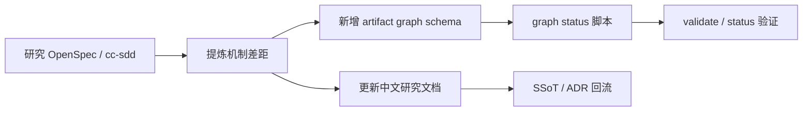

# Design

## Summary

本次采用“研究沉淀 + 最小机制落地”的设计。研究部分以中文文档沉淀，机制部分先引入 JSON artifact graph 和只读状态脚本，为 v0.2 的 schema-driven workflow 打基础。

## Requirement Traceability

| Requirement | Design Decision |
|---|---|
| FR-1 | 新增 `openspec-implementation-study.md`，按 CLI、artifact graph、validation、apply/archive、config 拆解 |
| FR-2 | 新增 `cc-sdd-implementation-study.md`，按 installer、manifest、skills、review gate、impl loop 拆解 |
| FR-3 | 新增 `specforge-gap-analysis.md`，形成问题表、借鉴表、路线图 |
| FR-4 | 新增 `.specforge/schemas/standard.json` 和 `.specforge/tools/artifact-graph-status.mjs` |
| FR-5 | 新增 `localization.md` 和 ADR，更新关键说明为中文 |

## Boundary Commitments

### Allowed Write Scope

- `docs/research/`
- `docs/architecture/`
- `.specforge/schemas/`
- `.specforge/rules/`
- `.specforge/tools/`
- `.specforge/project/`
- 当前 change 目录
- `README.md`
- `package.json`

### Forbidden Scope

- 不改业务代码运行时。
- 不引入 npm 依赖。
- 不重写所有已有技能。
- 不删除旧 archive change。

### Upstream Contracts

- 继续兼容现有 `node .specforge/tools/validate-structure.mjs`。
- 继续兼容现有 `node .specforge/tools/status.mjs`。
- `change.yaml` gate 状态仍使用 `APPROVED` / `PENDING`。

### Downstream Revalidation

- 后续修改 scaffolding 时，需要验证 artifact graph 状态判断。
- 后续引入正式 CLI 时，需要验证 scripts 是否迁移或保留。

## Affected Areas

- README 和研究文档。
- 项目 SSoT：architecture、validation-model、feature-list、ADR。
- 静态规则：artifact graph、中文优先。
- 执行脚本：新增 graph status。

## Data and API Changes

无外部 API。新增内部 JSON schema：

- `.specforge/schemas/standard.json`

## File Structure Plan

| Path | Ownership | Notes |
|---|---|---|
| `.specforge/schemas/standard.json` | Workflow schema | 标准流程 artifact graph |
| `.specforge/rules/artifact-graph.md` | Rule | artifact graph 规则 |
| `.specforge/rules/localization.md` | Rule | 中文优先规则 |
| `.specforge/tools/artifact-graph-status.mjs` | Script | 读取 schema + active change 状态 |
| `docs/research/openspec-implementation-study.md` | Research | OpenSpec 深度研究 |
| `docs/research/cc-sdd-implementation-study.md` | Research | cc-sdd 深度研究 |
| `docs/research/specforge-gap-analysis.md` | Research | 差距分析 |
| `docs/architecture/v0.2-reference-architecture.md` | Architecture | v0.2 参考架构 |
| `.specforge/project/decisions/ADR-0004-artifact-graph-driven-workflow.md` | ADR | artifact graph 决策 |
| `.specforge/project/decisions/ADR-0005-chinese-first-content.md` | ADR | 中文优先决策 |

## Flow

## Validation Strategy

- 运行 `node .specforge/tools/validate-structure.mjs`。
- 运行 `node .specforge/tools/artifact-graph-status.mjs`。
- 运行 `node .specforge/tools/status.mjs`。
- 人工检查新增研究文档是否覆盖实现机制，而不是只复述 README。

## Risks

- 当前 `graph:status` 仍是过渡实现，因为 change 创建时会一次性生成所有模板。
- 中文化仍未全量完成，需要后续专项变更。
- 没有实现正式 instructions CLI，当前只是准备 schema 基础。

## Alternatives Considered

- 只写研究文档，不加机制：过于轻，无法回应“内容太简单”的问题。
- 直接实现完整 CLI：范围过大，当前更适合先确立架构方向和最小状态能力。
