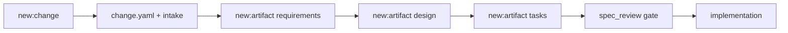

# Design

## 摘要

本次设计将脚手架拆成两个动作：`new:change` 创建控制面和 intake，`new:artifact` 根据 workflow schema 创建后续产物。校验脚本改为理解 active 和 archive 的生命周期差异。中文化则覆盖 Agent 入口、规则、技能、命令卡、模板和 project SSoT 的核心文件。

## 需求追踪

| Requirement | Design Decision |
|---|---|
| FR-1 | 改写 `.specforge/tools/create-change.mjs`，只生成 intake |
| FR-2 | 新增 `.specforge/tools/create-artifact.mjs` 和 `npm run new:artifact` |
| FR-3 | 改写 `.specforge/tools/validate-structure.mjs`，active 允许未完成 |
| FR-4 | archived change 必须具备完整 artifact 和 approved evidence |
| FR-5 | 中文化核心文档、rules、skills、templates |

## 边界承诺

### 允许写入范围

- `.specforge/tools/`
- `package.json`
- `.specforge/`
- `docs/`
- `.specforge/project/`
- 当前 change 目录
- `README.md`

### 禁止范围

- 不修改 archived change 的历史内容。
- 不引入外部 npm 包。
- 不改变 `standard.json` 的 artifact ID。

### 上游契约

- `standard.json` 定义 artifact outputs。
- `change.yaml` 保持 gate block 格式。
- registry 使用 path 字段定位 change。

### 下游重新验证

- 新 workflow schema 需要复用 validate 和 create-artifact 规则。
- 正式 CLI 化时需要迁移 scripts 行为。

## 影响区域

- 本地脚本。
- 核心规则、技能、模板。
- README 和 getting-started。
- project SSoT。

## 数据和 API 变化

新增 npm script：

```bash
node .specforge/tools/create-artifact.mjs <artifact-id>
```

## 文件结构计划

| Path | Ownership | Notes |
|---|---|---|
| `.specforge/tools/create-change.mjs` | Change scaffolding | 只生成控制面和 intake |
| `.specforge/tools/create-artifact.mjs` | Artifact scaffolding | 按 schema 生成指定产物 |
| `.specforge/tools/validate-structure.mjs` | Validation | 区分 active / archive |
| `.specforge/tools/artifact-graph-status.mjs` | Status | 依赖未满足时不判 done |
| `.specforge/templates/*` | Templates | 中文化 |
| `.specforge/skills/*/SKILL.md` | Skills | 中文化 |
| `.specforge/commands/*.md` | Command cards | 中文化 |

## 流程



## 验证策略

- `node .specforge/tools/validate-structure.mjs`
- `node .specforge/tools/artifact-graph-status.mjs`
- `node .specforge/tools/create-change.mjs --dry-run "Progressive Probe"`
- `node .specforge/tools/create-artifact.mjs --dry-run implementation`
- `node .specforge/tools/status.mjs`

## 风险

- CHG-004 是旧脚手架创建的，已有全量模板，所以 graph status 需要依赖状态收紧避免误判。
- 仍有历史 archived 内容未中文化。

## 备选方案

- 继续全量模板生成：简单但会污染状态判断。
- 一次实现完整 CLI：范围过大，先用 scripts 稳定协议。
