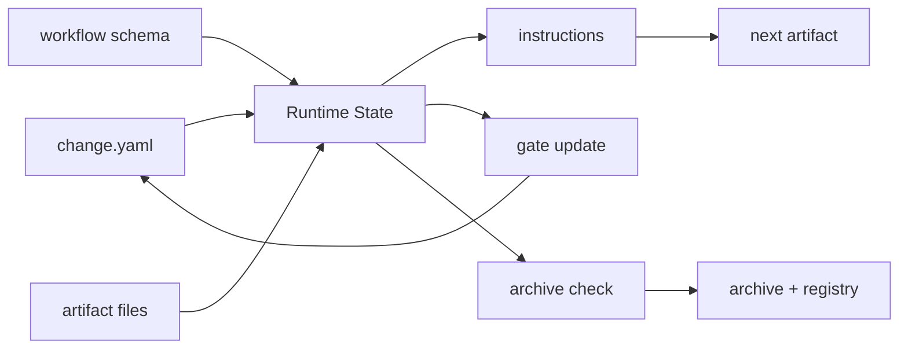

# 技术设计

## 摘要

本设计采用“小运行时内核 + schema 驱动”的方式补强 SpecForge。新增脚本不直接写死完整流程，而是优先读取 `.specforge/schemas/standard.json`，再结合当前 change 的 `change.yaml`、artifact 输出文件和 gate 状态计算下一步。

设计重点：

- `.specforge/tools/lib/specforge.mjs` 提供共享读写、change 解析、schema 加载、artifact 状态计算、gate 更新和模板映射。
- `.specforge/tools/instructions.mjs` 负责把 artifact 图翻译成 Agent 可执行指令。
- `.specforge/tools/gate.mjs` 负责安全更新 gate 状态。
- `.specforge/tools/archive-change.mjs` 负责归档前校验和 registry 同步。
- `closure` artifact 负责把 `release.md`、`rollback.md` 纳入可验证收尾阶段。

## 需求追踪

| Requirement | Design Decision |
|---|---|
| 下一步指令生成 | 使用 `computeArtifactStates()` 找到 ready artifact，输出规则、依赖、模板和 gate 信息 |
| 指定 artifact 指令 | `instructions <artifact>` 直接查询 schema 中 artifact 定义 |
| apply 模式 | 读取 `schema.apply.requires` 和 `schema.apply.tracks`，解析 tasks checkbox |
| gate 更新 | `gate.mjs` 校验证据文件存在后，只更新 `change.yaml` 中对应 gate block |
| 归档收口 | `archive-change.mjs` 检查 `schema.archive.requires` 和全部 artifact 状态 |
| closure 纳入图 | `standard.json` 新增 `closure`，依赖 `ssot_sync`，输出 release/rollback |
| 增强校验 | `validate-structure.mjs` 增加模板映射、循环依赖、生命周期状态检查 |

## 边界承诺

### 允许写入范围

- `.specforge/schemas/standard.json`
- `.specforge/tools/lib/specforge.mjs`
- `.specforge/tools/instructions.mjs`
- `.specforge/tools/gate.mjs`
- `.specforge/tools/archive-change.mjs`
- `.specforge/tools/validate-structure.mjs`
- `package.json`
- 当前 change 目录
- 必要的项目 SSoT 和 docs

### 禁止范围

- 不移动旧 archive change。
- 不改写旧 change 的语义内容。
- 不引入第三方依赖。
- 不把脚本实现成全局 CLI 或 npm package。

### 上游契约

- `standard.json` 中 artifact 的 `id/requires/outputs/gate/stage` 是运行时事实源。
- `change.yaml` 中 `workflow/status/stage/gates` 是 change 状态事实源。
- `.specforge/registry.yaml` 使用 `active/blocked/archive` 三段索引。

### 下游重新验证

- 每次 schema 修改后运行 `node .specforge/tools/validate-structure.mjs`。
- 每次 gate/归档脚本修改后用当前 CHG-005 实测。
- 每次 registry 更新逻辑修改后运行 `node .specforge/tools/status.mjs`。

## 影响区域

- 工作流 schema：新增 closure artifact 和 archive 依赖。
- 命令层：新增 `instructions`、`gate`、`archive`。
- 校验层：增强 schema 和 registry 的一致性检查。
- 文档层：需要说明新生命周期命令。

## 数据和 API 变化

- `standard.json` 新增 artifact：
  - `id: closure`
  - `stage: 06-closure`
  - `outputs: 06-closure/release.md, 06-closure/rollback.md`
  - `requires: ssot_sync`
- `package.json` 新增 npm scripts：
  - `instructions`
  - `gate`
  - `archive`

## 文件结构计划

| Path | Ownership | Notes |
|---|---|---|
| `.specforge/tools/lib/specforge.mjs` | Runtime helper | 共享 schema、change、gate、artifact 计算逻辑 |
| `.specforge/tools/instructions.mjs` | Runtime command | 输出 Agent 下一步工作指令 |
| `.specforge/tools/gate.mjs` | Runtime command | 更新 gate 状态和 evidence |
| `.specforge/tools/archive-change.mjs` | Runtime command | 归档 active change 并更新 registry |
| `.specforge/schemas/standard.json` | Workflow schema | 新增 closure artifact |
| `.specforge/tools/validate-structure.mjs` | Validation | 增强结构校验 |
| `docs/getting-started.md` | Documentation | 更新实际命令流 |
| `.specforge/project/engineering/validation-model.md` | SSoT | 记录运行时校验模型 |
| `.specforge/project/decisions/ADR-0006-runtime-instructions-and-gates.md` | SSoT | 记录本次架构决策 |

## 流程

## 验证策略

- 先运行 `node .specforge/tools/validate-structure.mjs` 确认旧历史不破。
- 创建 CHG-005，验证 `instructions` 可以识别 requirements。
- 逐步生成 requirements/design/tasks/spec_review。
- 使用 `gate` 命令批准 spec_review 后，检查 `instructions -- apply`。
- 继续生成 implementation/code_review/verification/ssot_sync/closure，并逐个 gate。
- 使用 `archive` 命令归档 CHG-005。
- 最后运行 `validate/status/graph:status`。

## 风险

- **registry 更新误伤**：用 active-only 归档并只删除当前 id 的 entry；归档前先校验。
- **gate 被批准但证据缺失**：`APPROVED` 强制要求 evidence 文件存在。
- **schema 被改出环**：validate 增加 DFS 环检测。
- **模板映射遗漏**：validate 检查 artifact outputs 是否能找到模板。
- **命令输出太散**：instructions 保持人类可读，同时支持 JSON。

## 备选方案

- 直接引入第三方 YAML parser：暂缓，v0.1 保持零依赖，等格式复杂后再引入。
- 所有命令一次性改造成完整 CLI：暂缓，当前先用 npm scripts 证明协议可运行。
- 把 gate 状态放到独立文件：暂缓，`change.yaml` 继续作为单 change 控制面。
