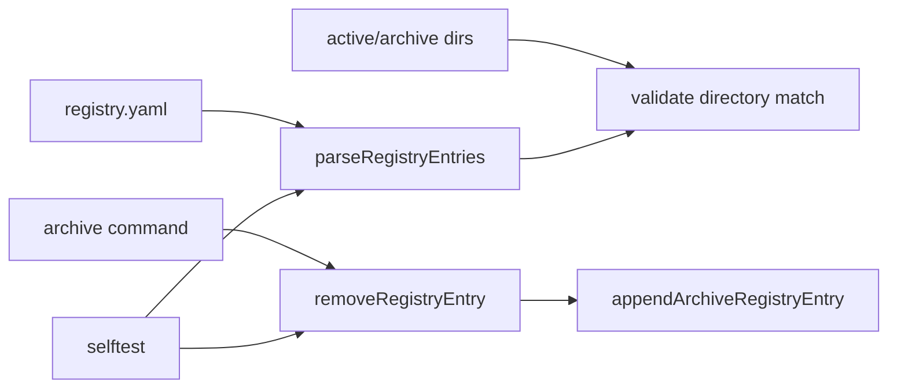

# 技术设计

## 摘要

本变更采用“共享 registry 函数 + 轻量自测 + validate 双向检查”的设计。归档命令不再内联 registry 文本处理逻辑，避免修复只停留在单个脚本里。

## 需求追踪

| Requirement | Design Decision |
|---|---|
| registry 删除 bug 被覆盖 | 新增 `.specforge/tools/self-test.mjs`，使用内存字符串测试 |
| archive 复用共享逻辑 | registry helper 放入 `.specforge/tools/lib/specforge.mjs` |
| validate 双向一致 | 解析 registry active/archive entry，与目录列表互相检查 |
| 保持零依赖 | 使用 `node:assert/strict` 和标准库 |

## 边界承诺

### 允许写入范围

- `.specforge/tools/lib/specforge.mjs`
- `.specforge/tools/archive-change.mjs`
- `.specforge/tools/self-test.mjs`
- `.specforge/tools/validate-structure.mjs`
- `package.json`
- README / SSoT 中必要说明
- 当前 change 目录

### 禁止范围

- 不修改已归档 change 的内容。
- 不引入外部测试依赖。
- 不改变 registry 文件格式。

### 上游契约

- registry entry 使用 `id/title/type/status/path` 字段。
- active entry path 必须在 `.specforge/changes/active/<id>`。
- archive entry path 必须在 `.specforge/changes/archive/<id>`。

### 下游重新验证

- `node .specforge/tools/self-test.mjs`
- `node .specforge/tools/validate-structure.mjs`
- `node .specforge/tools/archive-change.mjs -- --dry-run`

## 影响区域

- 归档命令。
- 结构校验。
- 项目自测能力。

## 数据和 API 变化

- 新增 npm script：`selftest`。
- 新增共享函数：
  - `removeRegistryEntry`
  - `normalizeEmptyActive`
  - `appendArchiveRegistryEntry`
  - `parseRegistryEntries`
  - `makeArchiveRegistryEntry`

## 文件结构计划

| Path | Ownership | Notes |
|---|---|---|
| `.specforge/tools/lib/specforge.mjs` | Runtime helper | registry helper 和 parser |
| `.specforge/tools/archive-change.mjs` | Runtime command | 使用共享 registry helper |
| `.specforge/tools/self-test.mjs` | Test harness | 轻量内存自测 |
| `.specforge/tools/validate-structure.mjs` | Validation | registry 和目录双向一致性 |
| `package.json` | Scripts | 新增 `selftest` |

## 流程

## 验证策略

- 自测 registry 单 active 删除后变成 `active: []`。
- 自测删除一个 active 时保留另一个 active。
- 自测 archive entry 可追加并解析。
- validate 检查 registry entry 与目录双向匹配。

## 风险

- 文本解析仍然不是完整 YAML parser；通过自测覆盖当前格式。
- validate 双向检查可能暴露历史 registry 问题；当前已经验证通过。

## 备选方案

- 引入 YAML parser：暂缓，等 registry 结构复杂后再引入。
- 做完整测试框架：暂缓，当前先用 Node assert 覆盖已知 bug。
