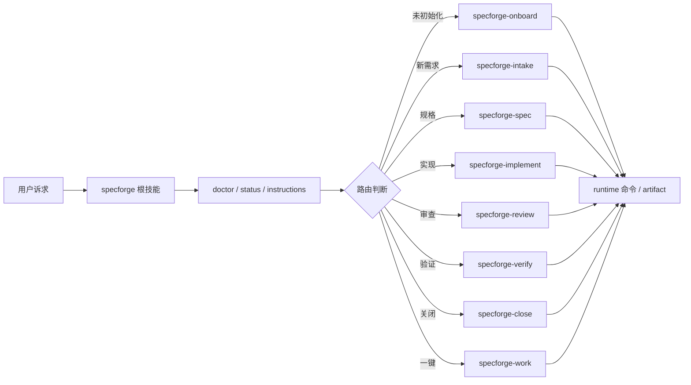

# 技术设计

## 摘要

本设计采用“根技能路由 + 子技能执行 + runtime 命令托底”的三层结构：

- 根技能 `specforge` 类似 CodeStable `cs`：只扫描仓库、判断状态、路由到一个子技能。
- 子技能 `specforge-*` 负责单阶段工作，避免一个大 skill 背负所有流程。
- runtime 命令继续承担确定性动作：创建 change、生成 artifact、更新 gate、归档、健康检查。

这种设计同时兼容 Codex Skills、Spec Kit 的 slash commands 和 OpenCode 的一键编排思路。

## 需求追踪

| Requirement | Design Decision |
|---|---|
| 根入口扫描和路由 | 新增 `.specforge/skills/specforge/SKILL.md` |
| 初始化路由 | 新增 `specforge-onboard` 骨架 |
| 新需求进入 change | 新增 `specforge-intake` |
| 规格阶段 | 新增 `specforge-spec`，内部调用 `instructions` / `new:artifact` |
| 实现阶段 | 新增 `specforge-implement`，先用 `instructions -- apply` |
| 审查阶段 | 新增 `specforge-review`，内部更新 gate |
| 验证阶段 | 新增 `specforge-verify` |
| 关闭阶段 | 新增 `specforge-close` |
| 健康检查 | 新增 `doctor` 命令和 `specforge-doctor` |
| 一键推进 | 新增 `specforge-work`，定义自动推进但不绕 gate |

## 边界承诺

### 允许写入范围

- `.specforge/skills/specforge*/SKILL.md`
- `.specforge/commands/specforge.doctor.md`
- `.specforge/commands/specforge.work.md`
- `.specforge/AGENTS.md`
- `.specforge/tools/doctor.mjs`
- `package.json`
- `.specforge/tools/validate-structure.mjs`
- `docs/ai-usage.md`
- `README.md`
- `.specforge/project/*`
- 当前 change 目录

### 禁止范围

- 不修改旧 archive change 的内容。
- 不安装全局 skill。
- 不重命名现有 `.specforge/skills/requirements` 等阶段技能。
- 不移除 runtime 命令。

### 上游契约

- `node .specforge/tools/status.mjs`、`node .specforge/tools/artifact-graph-status.mjs`、`node .specforge/tools/instructions.mjs` 是根技能判断状态的命令来源。
- `.specforge/schemas/standard.json` 是 artifact graph 来源。
- `change.yaml` 是单个 change 的状态来源。

### 下游重新验证

- 新增技能后运行 `node .specforge/tools/validate-structure.mjs`。
- 新增 doctor 后运行 `node .specforge/tools/doctor.mjs`。
- 根技能和子技能文档变更后，用 CHG-007 自举流程验证。

## 影响区域

- AI Agent 入口协议。
- Skill 目录结构。
- 本地健康检查命令。
- README 和 AI 使用文档。

## 数据和 API 变化

- 新增 npm script：
  - `doctor`
- 新增命令卡：
  - `specforge.doctor`
  - `specforge.work`
- 新增 AI 技能：
  - `specforge`
  - `specforge-onboard`
  - `specforge-intake`
  - `specforge-spec`
  - `specforge-implement`
  - `specforge-review`
  - `specforge-verify`
  - `specforge-close`
  - `specforge-doctor`
  - `specforge-work`

## 文件结构计划

| Path | Ownership | Notes |
|---|---|---|
| `.specforge/skills/specforge/SKILL.md` | Root skill | 扫描、路由、不直接做产物 |
| `.specforge/skills/specforge-*/SKILL.md` | Stage skills | 生命周期阶段技能 |
| `.specforge/tools/doctor.mjs` | Runtime command | 聚合健康检查 |
| `docs/ai-usage.md` | Documentation | AI 使用方式 |
| `.specforge/AGENTS.md` | Agent protocol | 引导优先使用 root skill/runtime |
| `.specforge/project/decisions/ADR-0007-ai-skill-entry.md` | SSoT | 记录技能入口决策 |

## 流程

## 验证策略

- 用 `node .specforge/tools/doctor.mjs` 验证健康检查命令。
- 用 `node .specforge/tools/validate-structure.mjs` 验证新增文件进入 required paths。
- 用 CHG-007 生成 spec/review/verification/closure 并归档。
- 查看根技能是否只路由，不写产物。
- 查看一键模式是否明确不绕过 gate。

## 风险

- **技能过多导致触发混乱**：根技能每次只路由一个子技能；子技能职责单一。
- **一键模式诱导跳过门控**：`specforge-work` 明确必须生成 evidence，并在 gate 前停顿或记录批准依据。
- **命令和技能漂移**：`docs/ai-usage.md` 维护技能到命令的映射。
- **根技能太长**：保持类似 `cs` 的短路由表，阶段细节放子技能。

## 备选方案

- 只做 slash commands：不够适配 Codex Skills，暂不采用。
- 只做一个巨型 `specforge` skill：上下文太重，后续难维护。
- 直接复用现有 `requirements/design` 技能：缺少面向用户诉求的统一入口，仍需要新增根技能。
