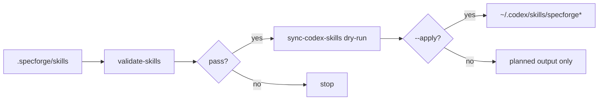

# 技术设计

## 摘要

本设计增加两个脚本：

- `.specforge/tools/validate-skills.mjs`：检查 `.specforge/skills` 的 Codex Skill 基本规范和命令引用。
- `.specforge/tools/sync-codex-skills.mjs`：将 repo 内 `specforge` / `specforge-*` skills 同步到 `~/.codex/skills`。

同步策略采用“显式命名空间优先”：只同步 `specforge` 根技能和 `specforge-*` 子技能。旧的 `requirements`、`design`、`status` 等阶段技能保留在仓库内部，不进入全局技能目录。

## 需求追踪

| Requirement | Design Decision |
|---|---|
| 校验 skill frontmatter | 解析 `---` 包裹的 YAML-like metadata |
| 检查目录名和 name 一致 | `folder basename === frontmatter.name` |
| 检查 npm script 引用 | 扫描 `npm run <script>`，对照 `package.json.scripts` |
| 默认不写全局目录 | sync 脚本默认 dry-run |
| 只同步命名空间 skill | 默认 filter：`specforge` 或 `specforge-*` |
| 可真实安装 | `--apply` 写入 `~/.codex/skills/<name>/SKILL.md` |
| doctor 纳入 skill 校验 | `doctor` 增加 `validate-skills` check |

## 边界承诺

### 允许写入范围

- `.specforge/tools/validate-skills.mjs`
- `.specforge/tools/sync-codex-skills.mjs`
- `.specforge/tools/doctor.mjs`
- `package.json`
- `.specforge/tools/validate-structure.mjs`
- `README.md`
- `docs/ai-usage.md`
- `.specforge/project/*`
- 当前 change 目录
- `~/.codex/skills/specforge*`，仅在运行 `--apply` 时

### 禁止范围

- 不写入 `~/.codex/skills/requirements` 等非命名空间 skill。
- 不删除用户已有全局 skill。
- 不修改 `.codex/skills/.system`。
- 不新增第三方依赖。

### 上游契约

- Repo-local skills 源路径：`.specforge/skills/<name>/SKILL.md`。
- Codex 全局目标路径：`~/.codex/skills/<name>/SKILL.md`。
- `package.json.scripts` 是命令引用校验的事实源。

### 下游重新验证

- 修改 skill 后运行 `node .specforge/tools/validate-skills.mjs`。
- 自动推进或进入仓库时运行 `node .specforge/tools/doctor.mjs`。
- 同步前先运行 `node .specforge/tools/sync-codex-skills.mjs` dry-run。

## 影响区域

- Skill 质量控制。
- Codex 全局技能可发现性。
- Doctor 健康检查。

## 数据和 API 变化

- 新增 npm scripts：
  - `validate:skills`
  - `sync:codex-skills`

## 文件结构计划

| Path | Ownership | Notes |
|---|---|---|
| `.specforge/tools/validate-skills.mjs` | Validation | Skill frontmatter 和命令引用检查 |
| `.specforge/tools/sync-codex-skills.mjs` | Sync | repo-local 到 `~/.codex/skills` |
| `.specforge/tools/doctor.mjs` | Runtime | 增加 skill 校验 |
| `docs/ai-usage.md` | Documentation | 增加安装 / 同步说明 |

## 流程

## 验证策略

- `node .specforge/tools/validate-skills.mjs`
- `node .specforge/tools/doctor.mjs`
- `node .specforge/tools/sync-codex-skills.mjs`
- `node .specforge/tools/sync-codex-skills.mjs -- --apply`
- 检查 `~/.codex/skills/specforge/SKILL.md`

## 风险

- **污染全局技能命名空间**：默认只同步 `specforge` 和 `specforge-*`。
- **覆盖用户自定义同名技能**：输出 action；后续可加 backup，本次先保持简单。
- **校验过松**：本次检查基础结构和命令引用，后续再加 description 质量评分。

## 备选方案

- 直接手动复制技能：不可重复，不采用。
- 同步全部 `.specforge/skills`：会污染全局命名，不采用。
- 用 symlink：跨工具兼容性不确定，暂不采用。
