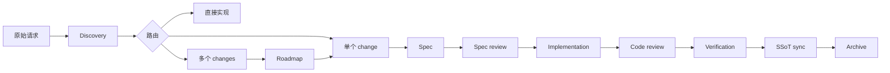

# SpecForge v0.1 Harness Model

SpecForge v0.1 是文件原生的工程协议。它不要求完整 CLI，也不绑定某个 IDE。

## 分层

| 层 | 目录 | 职责 |
|---|---|---|
| Agent 入口 | `AGENTS.md`, `.specforge/AGENTS.md` | 告诉 Agent 从哪里开始、哪些事情不能做 |
| 静态引擎 | `.specforge/` | workflows、schemas、skills、rules、templates、command cards |
| 动态资产 | `.specforge/` | registry、project SSoT、active changes、archive |
| 机器检查 | `.specforge/tools/` | validate、status、graph status、change/artifact scaffolding |
| 产品文档 | `docs/` | 对外说明、架构说明、研究综合 |

## 控制流

## 设计倾向

- 自动化之前，先保证协议可读。
- initiative 之前，先优先小 change。
- 实现细节之前，先明确边界契约。
- 全局上下文之前，先渐进加载上下文。
- 状态声称之前，先提供验证证据。

## v0.1.1 调整

`new:change` 不再提前生成所有阶段模板，而是只生成控制面和 intake。后续通过 `new:artifact` 按 artifact graph 逐步生成。
