# SpecForge v0.2 参考架构

## 目标

v0.2 的目标是把 SpecForge 从“目录模板”推进到“可执行的规格工作流协议”。它仍然保持 repository-native，但流程状态、下一步指令、校验和归档都要能由项目文件计算出来。

## 分层

| 层 | 目录 | 职责 |
|---|---|---|
| 静态引擎 | `.specforge/` | 工作流 schema、规则、技能、模板、命令、适配器 |
| 动态资产 | `.specforge/` | 项目长期知识、变更、证据、归档 |
| 执行工具 | `.specforge/tools/` 或未来 CLI | 状态、指令、校验、创建、归档 |
| 业务代码 | `src/`, `tests/` | 被 SpecForge 管理的实际工程代码 |

## 控制面

SpecForge 的控制面由三类文件组成：

| 文件 | 作用 |
|---|---|
| `.specforge/manifest.yaml` | 当前项目使用的 SpecForge 版本、profile、路径约定 |
| `.specforge/schemas/<workflow>.json` | artifact graph、gate、apply、archive 条件 |
| `.specforge/changes/.../change.yaml` | 单个变更的状态、当前阶段、gate 证据 |

## Artifact Graph

标准流程的 artifact 图：

```mermaid
flowchart LR
  intake["intake"] --> requirements["requirements"]
  requirements --> design["design"]
  design --> tasks["tasks"]
  tasks --> spec_review["spec_review gate"]
  spec_review --> implementation["implementation"]
  implementation --> code_review["code_review gate"]
  code_review --> verification["verification gate"]
  verification --> ssot_sync["ssot_sync gate"]
  ssot_sync --> closure["closure"]
```



状态定义：

| 状态 | 含义 |
|---|---|
| `done` | 产物或 gate 已满足完成条件 |
| `ready` | 依赖已满足，可以生成或审查 |
| `blocked` | 依赖未满足 |
| `partial` | artifact 只有部分输出存在，需要修正后才能继续 |

## 指令生成

当前 v0.1 已支持 npm script 形式：

```bash
node .specforge/tools/instructions.mjs
node .specforge/tools/instructions.mjs -- requirements --json
node .specforge/tools/instructions.mjs -- apply
```

输出应包含：

- 当前 artifact 的说明。
- 输出路径。
- 依赖 artifact 及文件路径。
- 必须加载的 rules。
- 需要使用的 template。
- 成功标准。
- 完成后解锁的 artifact。

Agent 应优先使用这类命令获取上下文，而不是一次性读完整 `.specforge/`。

## Gate 和归档命令

当前 v0.1 已支持：

```bash
node .specforge/tools/gate.mjs spec_review APPROVED --evidence 02-spec-review/spec-review-v1.md
node .specforge/tools/archive-change.mjs
```

`gate` 负责把审查结论写回 `change.yaml`。`archive` 负责检查 workflow 完整性、移动目录并同步 registry。

## 校验模型

v0.2 校验应从“路径存在”升级为四层：

| 层 | 检查内容 |
|---|---|
| 结构校验 | 必要目录、文件、schema、registry、change.yaml |
| 图校验 | artifact 依赖是否闭环、是否存在未知依赖、gate 是否存在 |
| 内容校验 | requirements/design/tasks 是否符合模板和最小结构 |
| 证据校验 | gate APPROVED 时 evidence 是否存在且内容可审查 |

## 归档模型

归档必须是一个事务流程：

1. 验证所有必需 artifact 和 gate。
2. 读取 SSoT sync 记录。
3. 如有 delta spec，应用到长期规格。
4. 更新 `.specforge/registry.yaml`。
5. 将 change 从 active 移到 archive。
6. archive 默认只读。

## 中文化

默认人类可读内容使用中文。英文只保留在：

- 命令、路径、代码标识符。
- 协议状态值。
- 外部项目原名。
- 必须与生态保持一致的术语。

## v0.2 最小可用标准

| 能力 | 验收标准 |
|---|---|
| Artifact graph | `node .specforge/tools/artifact-graph-status.mjs` 可显示 active change 的 ready / blocked / done |
| 指令生成 | 可为下一 artifact 输出规则、依赖、模板和路径 |
| 渐进 scaffolding | new change 不再创建所有阶段模板 |
| 强校验 | validate 能发现 schema、gate、registry、内容结构问题 |
| 中文基线 | 核心规则、模板、项目 SSoT 和研究文档为中文 |
| Gate 命令 | APPROVED 必须绑定 evidence |
| 归档命令 | closure 完成前不能归档 |
