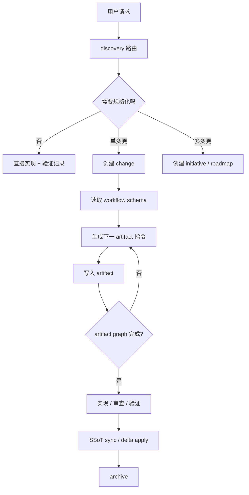

# SpecForge 差距分析与升级路线

基于：

- [Fission-AI/OpenSpec](https://github.com/Fission-AI/OpenSpec)
- [gotalab/cc-sdd](https://github.com/gotalab/cc-sdd)

## 一句话判断

当前 SpecForge v0.1 还是“目录和模板骨架”，距离“可执行的 SDD 工作流框架”还有明显差距。真正需要补的是：artifact graph、指令生成、结构校验、变更回流、强技能协议、多工具适配和中文优先内容体系。

## 当前主要问题

| 问题 | 现状 | 风险 |
|---|---|---|
| 流程硬编码 | workflow 只是阶段列表 | 无法根据不同 schema 推导下一步 |
| 产物一次性生成 | new change 创建所有阶段模板 | 文件存在不代表完成 |
| gate 偏人工 | gate 只看 `APPROVED` 和 evidence 路径 | 无法判断 evidence 内容质量 |
| 无指令生成 | Agent 需要自己读规则和模板 | 容易漏上下文、漏依赖、漏输出路径 |
| 无 delta spec | SSoT sync 只靠人工填写 | 长期知识容易漂移 |
| 技能还浅 | skill 多是原则和提示 | 缺少输入、输出、审查循环、失败路径 |
| 无 adapter | 当前只适配当前仓库 | 无法安装到多 AI coding 工具 |
| 英中文混杂 | 多数文档仍是英文 | 不适合用户后续中文协作习惯 |

## OpenSpec 能补的部分

| OpenSpec 能力 | SpecForge 对应升级 |
|---|---|
| `schema.yaml` 定义 artifact graph | `.specforge/schemas/<workflow>.json/yaml` |
| `status` 计算 done / ready / blocked | `specforge status` 读取 artifact graph |
| `instructions` 生成上下文指令 | `specforge instructions <artifact>` |
| `apply` 读取任务和上下文 | `specforge apply` 或实现技能使用同一数据 |
| delta spec apply | closure 阶段把 change 合并到 `.specforge/project/` |
| archive 前校验 | archive = validate + ssot apply + move |
| project config context/rules | `.specforge/config.yaml` |

## cc-sdd 能补的部分

| cc-sdd 能力 | SpecForge 对应升级 |
|---|---|
| manifest installer | `.specforge/adapters/manifest.json` |
| agent registry | 多工具 adapter registry |
| shared rules | rules 复用和 skill 注入 |
| discovery router | 强化 discovery skill |
| requirements/design/tasks review gate | 写入前审查循环 |
| autonomous impl loop | 后续 task-level Agent runtime |
| feature validation | 验证加入集成、密钥、liveness、边界审计 |

## v0.2 目标结构

```text
.specforge/
├── AGENTS.md
├── manifest.yaml
├── config.yaml                  # 项目上下文和规则注入
├── schemas/                     # artifact graph
│   ├── lite.json
│   ├── standard.json
│   └── bugfix.json
├── workflows/                   # 人类可读 workflow 说明
├── agents/
├── rules/
├── skills/
├── templates/
├── validators/                  # 结构校验规则或脚本
├── commands/                    # 命令卡 / slash command 模板
└── adapters/                    # Codex / Claude / Cursor / Copilot 等适配

.specforge/
├── registry.yaml
├── project/
├── initiatives/
└── changes/
    ├── inbox/
    ├── active/
    └── archive/
```

## v0.2 运行机制



## 分阶段落地

| 阶段 | 目标 | 完成标准 |
|---|---|---|
| v0.1.1 | 中文化和研究沉淀 | 核心研究、架构、规则文档中文优先 |
| v0.1.2 | artifact graph 只读化 | schema 文件存在，状态脚本能显示 ready / blocked / done |
| v0.2.0 | schema-driven scaffolding | new change 不再一次性生成所有产物，而是按 graph 生成 |
| v0.2.1 | instructions CLI | Agent 可通过命令获取下一产物指令 |
| v0.2.2 | stronger validation | 校验 requirements/design/tasks 结构和 gate evidence |
| v0.3.0 | SSoT apply/archive | archive 前能把变更回流长期规格 |
| v0.4.0 | adapter installer | 支持 Codex 外的工具安装 |

## 近期任务建议

| 优先级 | 任务 | 产出 |
|---|---|---|
| P0 | 全面中文化当前 `.specforge/`、`.specforge/project/`、`docs/` | 中文版 v0.1 文档基线 |
| P0 | 修改 change scaffolding，不再创建全部模板 | `new:change` 只生成 metadata + intake |
| P0 | 实现 `instructions` 脚本 | 给定 artifact 输出依赖、模板、规则、路径 |
| P1 | 引入 `config.yaml` | 项目 context / rules 可注入 |
| P1 | 增强 validator | schema、registry、change、gate evidence 校验 |
| P1 | 加入 delta spec 设计 | 规格回流模型文档和最小脚本 |
| P2 | adapter manifest 草案 | Codex / Claude / Cursor 路径映射 |

## 设计原则修正

SpecForge 后续不应宣传“我们有很多目录”，而应强调：

1. 每个产物都在图里，有依赖、有完成条件。
2. Agent 的下一步由命令生成，不靠记忆。
3. Gate 要先审查草稿，再写入最终产物。
4. Archive 必须回流长期知识。
5. 中文是默认协作语言。

