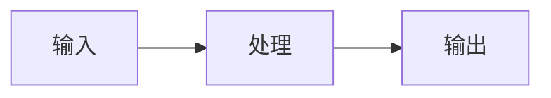

# Design

## 摘要

## 需求追踪

| Requirement | Design Decision |
|---|---|

## 边界承诺

### 允许写入范围

### 禁止范围

### 上游契约

### 下游重新验证

## 影响区域

## 数据和 API 变化

## 文件结构计划

| Path | Ownership | Notes |
|---|---|---|

## 流程

## 验证策略

## 风险

## 备选方案
