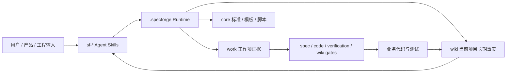
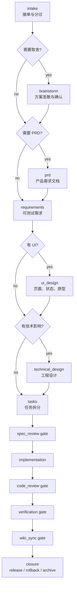
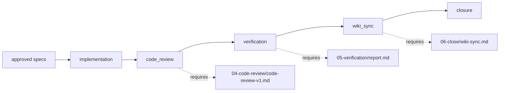

# SpecForge


SpecForge 是一个 **repository-native Spec-Driven Development 工作流运行时**。它把需求、PRD、设计、任务、实现证据、代码审查、验证、Wiki 和关闭记录都放回项目仓库，让 AI Agent 在同一套可审计规则下持续交付，而不是每次靠临场记忆重新理解项目。

它由两部分组成：

- `skills/`：安装到 AI 工具中的 `sf-*` 技能入口，负责引导 Agent 怎么工作。
- `.specforge/`：初始化到业务项目中的运行时目录，负责保存流程规则、项目 Wiki、工作项、门禁证据和脚本。

目标很直接：**让 AI 开发从“会聊天、会写代码”，变成“能按规格、证据和门禁推进项目”。**

## 为什么需要 SpecForge

AI Agent 写代码很快，但在真实项目里经常会遇到这些问题：

| 问题 | 常见后果 | SpecForge 的做法 |
|---|---|---|
| 需求模糊 | 边写边猜，范围不断膨胀 | `sf-intake`、`sf-brainstorm`、`sf-prd` 先把目标、边界和取舍写清 |
| 规格和实现脱节 | 实现完成后才发现不是用户想要的 | requirements、UI design、technical design、tasks 逐层约束 |
| 每次都重读全仓 | token 消耗高，理解不稳定 | 项目 Wiki-first，先从长期事实入手，再顺链路查代码 |
| Agent 记忆不可靠 | 上下文压缩或换工具后丢失关键事实 | `.specforge/wiki/` 和 work item evidence 固化项目记忆 |
| 缺少审查门禁 | “看起来能跑”就合并 | spec review、code review、verification、wiki sync 都有 evidence |
| 验证不完整 | UI、权限、回滚、异常路径漏测 | tasks 和 verification 明确测试矩阵与证据 |
| 知识无法沉淀 | 下次又要重新问、重新扫 | close 前把长期事实回写 Wiki |

SpecForge 不是一个新的 Web 框架，也不是一个简单 prompt 集合。它更像是给 AI Agent 使用的项目内 SDD 操作系统。

## 核心理念

### 1. Repository-native

所有长期有效的流程、知识和证据都跟着仓库走：

```text
your-project/
├── src/
├── package.json
└── .specforge/
    ├── AGENTS.md
    ├── core/
    ├── wiki/
    ├── work/
    └── registry.yaml
```

这样做的好处是：

- 不依赖某个聊天窗口的上下文。
- 不依赖某个 Agent 平台的私有记忆。
- 不把需求和验证证据散落在外部文档里。
- 换工具、换人、换机器后，项目状态依旧可恢复。

### 2. 先理解，再行动

SpecForge 的黄金法则是：

```text
先理解，再行动。
```

不确定就停下来问；缺规格就退回上游；需要改边界外文件就重新走设计或任务拆分。Agent 不应该用“我觉得应该这样”代替用户确认、代码证据或门禁证据。

### 3. Wiki-first，而不是每次全仓扫描

新一轮任务不应该默认读取全量代码。SpecForge 要求：

1. 先读 `.specforge/wiki/00-index.md`。
2. 再读相关的产品规则、架构、模块、API、数据、运维和风险文件。
3. 从 Wiki 提取入口路径、关键符号、上下游、测试位置和运行命令。
4. 只沿这些线索用 `rg`、CodeGraph、Repomix 或文件阅读验证事实。
5. Wiki 缺入口、过期或冲突时，先用 `sf-steering` 刷新项目画像。

这条规则能显著降低 token 浪费，也能让 Agent 的理解更稳定。

### 4. Gate 不是形式，Evidence 才是事实

SpecForge 的 gate 只有在证据存在时才允许批准：

- `spec_review`：规格是否足以实现。
- `code_review`：实现是否符合 approved spec、任务边界和工程规则。
- `verification`：测试、启动、E2E、权限、回滚等证据是否足够。
- `wiki_sync`：长期事实是否已经回写 Wiki，或明确说明没有长期影响。

“应该没问题”不是证据。“跑过什么、在哪里跑、结果是什么、覆盖了什么、没覆盖什么”才是证据。

### 5. Agent Skill 是入口，项目 Runtime 是事实

`skills/` 让 Agent 知道该调用哪个 `sf-*` 能力；`.specforge/` 让项目知道当前状态、规则和证据。

两者分离后，一个技能版本可以服务多个项目，每个项目又能保存自己的 Wiki、work item 和本地规则。

## 架构概览



### 两层结构

| 层 | 路径 | 作用 |
|---|---|---|
| Agent 技能层 | `skills/sf-*/SKILL.md` | 告诉 Codex、Claude Code、Cursor 等 Agent 如何执行 SpecForge 阶段 |
| 项目运行时层 | `.specforge/` | 保存项目规则、Wiki、work item、artifact、gate 和脚本 |
| 核心母本 | `core/` | SpecForge 运行时源码、模板、标准和验证脚本 |
| Starter 快照 | `starter/.specforge/` | 初始化业务项目时复制进去的 `.specforge` 基线 |

## 快速开始

### 1. 从 GitHub 安装 Agent Skills

SpecForge 遵循 `skills` CLI 的官方安装模式。你可以直接从 GitHub 仓库安装：

```bash
npx skills add https://github.com/huangrx6/SpecForge --skill "*" --agent codex --global
```

如果你想让安装器交互式选择 Agent，也可以省略 `--agent codex`：

```bash
npx skills add https://github.com/huangrx6/SpecForge --skill "*" --global
```

安装完成后，在 Agent 技能列表中应该能看到：

- `sf-router`
- `sf-intake`
- `sf-brainstorm`
- `sf-prd`
- `sf-requirements`
- `sf-ui-design`
- `sf-tech-design`
- `sf-tasking`
- `sf-spec-review`
- `sf-implement`
- `sf-code-review`
- `sf-verify`
- `sf-wiki`
- `sf-close`
- `sf-work`
- `sf-doctor`
- `sf-onboard`
- `sf-steering`

### 2. 初始化业务项目

在业务项目根目录执行：

```bash
npx github:huangrx6/SpecForge init --dir .
```

这会创建：

```text
.specforge/
├── AGENTS.md
├── manifest.yaml
├── project.yaml
├── registry.yaml
├── core/
├── hooks/
├── wiki/
└── work/
```

初始化后会自动运行 doctor 检查。如果项目已经有 `.specforge/`，CLI 默认不会覆盖。需要迁移已有项目时，建议让 Agent 使用 `sf-onboard`，而不是直接 `--force`。

### 3. 检查状态

```bash
node .specforge/core/scripts/workflow-audit.mjs
node .specforge/core/scripts/workflow-health.mjs
node .specforge/core/scripts/quality-suite.mjs
node .specforge/core/scripts/artifact-quality.mjs
node .specforge/core/scripts/closure-quality.mjs
node .specforge/core/scripts/source-quality.mjs
node .specforge/core/scripts/wiki-quality.mjs
node .specforge/core/scripts/stage-contract.mjs --overview
node .specforge/core/scripts/stage-contract.mjs
node .specforge/core/scripts/doctor.mjs
node .specforge/core/scripts/decision-brief.mjs
node .specforge/core/scripts/decision-quality.mjs
node .specforge/core/scripts/evidence-summary.mjs
node .specforge/core/scripts/implementation-quality.mjs
node .specforge/core/scripts/workflow-package.mjs
```

或：

```bash
npx github:huangrx6/SpecForge audit --dir .
npx github:huangrx6/SpecForge health --dir .
npx github:huangrx6/SpecForge quality-suite --dir .
npx github:huangrx6/SpecForge quality --dir .
npx github:huangrx6/SpecForge closure-quality --dir .
npx github:huangrx6/SpecForge source-quality --dir .
npx github:huangrx6/SpecForge wiki-quality --dir .
npx github:huangrx6/SpecForge roadmap --dir .
npx github:huangrx6/SpecForge contract --dir .
npx github:huangrx6/SpecForge doctor --dir .
npx github:huangrx6/SpecForge decision-brief --dir .
npx github:huangrx6/SpecForge decision-quality --dir .
npx github:huangrx6/SpecForge evidence --dir .
npx github:huangrx6/SpecForge implementation-quality --dir .
npx github:huangrx6/SpecForge package --dir .
```

### 4. 在 Agent 中开始使用

最简单的入口是告诉 Agent：

```text
sf
```

或者直接说：

```text
帮我用 SpecForge 创建一个新需求：增加用户导出审批记录功能
```

`sf-router` 会检查当前项目状态，然后路由到合适的技能。没有 active work item 时通常进入 `sf-intake`。

## 公司内部仓库用法

如果你的公司不能直接访问 GitHub，或者需要维护内部版本，可以把 SpecForge 放到内部 Git 仓库。

### 安装内部 Agent Skills

示例：

```bash
npx skills add git+ssh://git@git.company.com/team/specforge.git --skill "*" --agent codex --global
```

如果你的 `skills` CLI 只接受普通 Git URL，也可以使用公司 Git 服务提供的 HTTPS / SSH 地址：

```bash
npx skills add ssh://git@git.company.com/team/specforge.git --skill "*" --global
```

具体 URL 取决于公司 Git 平台格式。

### 从内部仓库初始化项目

如果内部仓库作为 npm package source 使用，可以这样初始化：

```bash
npm exec --yes \
  --package=git+ssh://git@git.company.com/team/specforge.git#v0.3.0-company.1 \
  -- specforge init --dir .
```

这种方式不依赖 npm registry 发布，只依赖 Git 仓库地址和 tag / branch。

## 日常工作流

SpecForge 的主线生命周期如下：



### 常见入口

| 你想做什么 | 推荐入口 |
|---|---|
| 新功能、新需求 | `sf-intake` |
| 用户想法很模糊 | `sf-brainstorm` |
| 需要 PRD | `sf-prd` |
| 写可测试需求 | `sf-requirements` |
| 设计后台、管理端、页面交互 | `sf-ui-design` |
| 设计 API、数据、架构、权限、配置 | `sf-tech-design` |
| 拆任务 | `sf-tasking` |
| 实现 | `sf-implement` |
| 代码审查 | `sf-code-review` |
| 验证与测试证据 | `sf-verify` |
| 回写长期项目知识 | `sf-wiki` |
| 关闭和归档 | `sf-close` |
| 不知道下一步 | `sf-router` 或直接说 `sf` |
| 想自动推进 | `sf-work` |

## Work Item

每个工作项保存在：

```text
.specforge/work/active/YYYYMMDD-kind-NNN-short-title/
```

典型结构：

```text
20260529-feat-001-export-approval-records/
├── work.yaml
├── 00-intake/
│   ├── original-request.md
│   ├── brief.md
│   ├── brainstorm.md
│   └── prd.md
├── 01-spec/
│   ├── requirements.md
│   ├── ui-design.md
│   ├── technical-design.md
│   └── tasks.md
├── 02-spec-review/
│   └── spec-review-v1.md
├── 03-implementation/
│   ├── plan.md
│   ├── report.md
│   └── changed-files.md
├── 04-code-review/
│   └── code-review-v1.md
├── 05-verification/
│   ├── test-cases.md
│   ├── report.md
│   └── ci-result.md
└── 06-close/
    ├── wiki-sync.md
    ├── release.md
    └── rollback.md
```

`work.yaml` 是这个工作项的状态源。它记录 workflow、components flags、gate 状态、evidence 路径和关联关系。

## Workflow 类型

| Workflow | 适用场景 | 主线 |
|---|---|---|
| `feature` | 新增用户能力或产品功能 | intake -> requirements -> optional UI / technical design -> tasks -> gates -> close |
| `standard` | 普通工程变更或跨域改动 | 类似 feature，更通用 |
| `lite` | 低风险小改 | intake -> requirements -> tasks -> implementation -> review -> verification -> close |
| `bugfix` | 明确缺陷修复 | intake -> gap report -> tasks -> implementation -> review -> verification -> close |
| `issue` | 运维、配置、环境或非产品问题 | intake -> gap report -> tasks -> implementation -> review -> verification -> close |
| `refactor` | 行为不变的技术债治理 | intake -> technical design -> tasks -> review -> implementation -> verification -> close |
| `discovery` | 预研、Spike、黑盒探索 | intake -> research -> wiki -> close |

## Wiki-first 项目知识库

`.specforge/wiki/` 是 SpecForge 的长期项目记忆。它不是过程日志，也不是 release note 的复制品。

默认文件：

| 文件 | 作用 |
|---|---|
| `00-index.md` | 知识库索引、任务入口导航、当前知识项 |
| `01-project-overview.md` | 项目目标、用户、核心能力、边界、常见任务入口 |
| `02-product-rules.md` | 稳定产品规则、角色、权限、状态和业务约束 |
| `03-architecture.md` | 技术栈、模块边界、入口、关键链路、代码导航 |
| `04-data-model.md` | 核心实体、表、关系、状态机、读写入口 |
| `05-operations.md` | 启动、构建、测试、部署、回滚、观察 |
| `06-decisions.md` | 长期架构 / 产品 / 技术决策 |
| `07-glossary.md` | 术语、缩写、领域语言 |
| `08-risks.md` | 风险、技术债、未知区和后续事项 |

按需新增：

| 文件模式 | 何时创建 |
|---|---|
| `module-<name>.md` | 某个模块足够稳定，需要独立维护职责、入口和上下游 |
| `api-<domain>.md` | 某个接口域包含多条 API / 事件 / Webhook / SDK 契约 |
| `design-system.md` | 项目形成稳定 UI 组件、token、视觉风格或后台规范 |

### Wiki 写作要求

Wiki 必须有信息密度，不能只写概述。

架构、模块、API、数据和运维类文件应尽量包含：

- 入口路径。
- 关键符号、路由、命令或配置。
- 上游和下游。
- 数据读写入口。
- 测试位置。
- 运行或验证命令。
- 推荐检索词。
- 未确认点和补证路径。

无法确认的内容写 `未确认`，并同步到 `08-risks.md`，不要包装成当前事实。

## Gate 与 Evidence



| Gate | Evidence | 批准条件 |
|---|---|---|
| `spec_review` | `02-spec-review/spec-review-v1.md` | requirements、UI / technical design、tasks 足以实现 |
| `code_review` | `04-code-review/code-review-v1.md` | 实现符合 approved spec、任务边界、工程规则 |
| `verification` | `05-verification/report.md` | 测试、启动、E2E、权限、回滚等证据足够 |
| `wiki_sync` | `06-close/wiki-sync.md` | 长期事实已回写，或明确无长期影响 |

批准 gate 的脚本形式：

```bash
node .specforge/core/scripts/gate-preflight.mjs code_review APPROVED \
  --evidence 04-code-review/code-review-v1.md

specforge gate --dir . code_review APPROVED --evidence 04-code-review/code-review-v1.md
```

`gate-preflight` 只做审批前检查，不改写 `work.yaml`。它会汇总 evidence、artifact ready 状态、P0 / P1 blocker、open decision、traceability gaps、workflow health 和 Quality Suite；`FAIL` 会返回非 0 退出码，`WARN` 默认只提醒，可用 `--strict` 在 CI 中阻断。

非批准状态不绑定 evidence：

```bash
node .specforge/core/scripts/gate.mjs code_review REQUEST_CHANGES
```

## 常用脚本

在已经初始化的业务项目中：

```bash
node .specforge/core/scripts/workflow-audit.mjs
node .specforge/core/scripts/workflow-health.mjs
node .specforge/core/scripts/quality-suite.mjs
node .specforge/core/scripts/artifact-quality.mjs
node .specforge/core/scripts/closure-quality.mjs
node .specforge/core/scripts/source-quality.mjs
node .specforge/core/scripts/wiki-quality.mjs
node .specforge/core/scripts/stage-contract.mjs --overview
node .specforge/core/scripts/stage-contract.mjs
node .specforge/core/scripts/doctor.mjs
node .specforge/core/scripts/status.mjs
node .specforge/core/scripts/instructions.mjs
node .specforge/core/scripts/decision-checkpoints.mjs
node .specforge/core/scripts/decision-brief.mjs
node .specforge/core/scripts/decision-quality.mjs
node .specforge/core/scripts/evidence-summary.mjs
node .specforge/core/scripts/source-quality.mjs
node .specforge/core/scripts/implementation-quality.mjs
node .specforge/core/scripts/traceability-summary.mjs
node .specforge/core/scripts/create-work.mjs --workflow feature "新增审批记录导出"
node .specforge/core/scripts/create-artifact.mjs requirements
node .specforge/core/scripts/render-work-report.mjs
node .specforge/core/scripts/handoff-summary.mjs --output <work-item>/07-report/handoff.md
node .specforge/core/scripts/workflow-package.mjs
node .specforge/core/scripts/closure-quality.mjs
node .specforge/core/scripts/gate-preflight.mjs verification APPROVED --evidence 05-verification/report.md
node .specforge/core/scripts/gate.mjs verification APPROVED --evidence 05-verification/report.md
node .specforge/core/scripts/sync-wiki.mjs
node .specforge/core/scripts/wiki-quality.mjs
```

`render-work-report.mjs` 生成的 HTML 首屏是 Action Board：先给当前状态、下一步、最高优先级、质量总态、复制命令和阅读顺序；完整 artifact 摘要、Quality Suite、traceability、gate 和长表放在下方。Markdown artifact 仍然是事实源。

`quality-suite.mjs` 是日常推进的阶段感知质量总入口。它总是检查 artifact 可读性、决策闭环和 traceability；到达或出现对应产物后再自动启用 source、implementation、verification evidence、wiki、closure 检查。这样用户和 Agent 可以先看一个 PASS / WARN / FAIL 总表，再按 Recommended Commands 下钻专项脚本。

`workflow-health.mjs` 会把 `quality-suite.mjs` 中 source、implementation、evidence、wiki、closure 等阶段感知质量缺口纳入 `quality_suite` 维度和健康分；artifact、decision、traceability 已有独立维度，不重复扣分。

`stage-contract.mjs --overview` / `specforge roadmap --dir .` 是流程导航层。输出会先给当前 work item、健康度和 Quality Suite，再用 Current Focus 聚焦当前 artifact 的状态、退出标准、必须证明的事项、人工确认点和质量热点，最后再展开完整 roadmap 表格。这样日常推进先看一屏即可知道下一步，不需要先读完整规格包。

`source-quality.mjs` 检查 `research.md` 的来源池和 `technical-design.md` 的版本事实 / 官方基准记录。缺少研究来源或权威度分级是 `FAIL`；轶事、过期、未知来源以及技术版本事实缺日期 / 来源是 `WARN`。`gate-preflight spec_review APPROVED` 会自动执行同类检查。

`decision-quality.mjs` 检查人工确认记录是否闭环：open decision 会 `FAIL`；`delegated_default` 必须有默认理由、风险影响和回退 / 重新验证触发条件；`manual-confirmed` / `deferred` 必须有 owner、影响和重新验证触发条件。所有 `gate-preflight <gate> APPROVED` 都会自动执行同类检查。

`implementation-quality.mjs` 检查 `tasks.md`、`03-implementation/report.md`、`03-implementation/changed-files.md` 和真实 `git diff/status` 是否一致。缺 task 核心字段、完成任务缺证据、真实 diff 未登记、changed-files 缺任务或验证方式会 `FAIL`；`gate-preflight code_review APPROVED` 会自动执行同类检查。

`closure-quality.mjs` 检查 `release.md` / `rollback.md` 是否真正覆盖发布结论、影响范围、发布前检查、观察点、回滚触发条件、风险来源和补偿措施。它不替代 `doctor` 和 `archive-work --dry-run`，而是在归档前提前暴露空模板和 release / rollback 断链。

`wiki-quality.mjs` 检查 `.specforge/wiki/` 的 frontmatter、`00-index.md` 引用、重复 current 项、日期 / 版本化命名和模板占位；`gate-preflight wiki_sync APPROVED` 会自动执行同类检查。结构性问题是 `FAIL`，内容薄或占位偏多是 `WARN`，需要在 wiki-sync evidence 中说明是否接受。

在 SpecForge 源码仓库中：

```bash
npm run validate
npm run validate:skills
npm run validate:external-skills
npm run check:starter
npm run doctor
npm run sync:starter
npm pack --dry-run
```

## 目录说明

源码仓库：

```text
specforge/
├── assets/
│   └── specforge-workflow-hero.png
├── cli/
│   └── specforge.mjs
├── core/
│   ├── artifacts/
│   ├── hooks/
│   ├── profiles/
│   ├── scripts/
│   ├── skills/
│   ├── standards/
│   ├── workflows/
│   └── starter.manifest.json
├── skills/
│   └── sf-*/
├── starter/
│   └── .specforge/
├── package.json
└── README.md
```

业务项目初始化后：

```text
your-project/
└── .specforge/
    ├── AGENTS.md
    ├── core/
    ├── hooks/
    │   └── local/
    ├── wiki/
    ├── work/
    │   ├── inbox/
    │   ├── active/
    │   └── archive/
    ├── project.yaml
    ├── manifest.yaml
    └── registry.yaml
```

## Hooks

`.specforge/hooks/local/` 用来放项目级自定义 hook。默认事件实现位于：

```text
.specforge/core/hooks/events/
```

当前支持：

| Hook | 触发时机 | 适合做什么 |
|---|---|---|
| `pre-gate` | gate 更新前 | 阻断缺少内部审批、缺少工单号、缺少安全签核等情况 |
| `post-gate` | gate 更新后 | 通知、同步内部系统、记录审计 |
| `pre-close` | close 前 | 检查 release、rollback、wiki sync 是否完整 |
| `on-close` | close 后 | 归档通知、同步知识库、清理临时资源 |

Hook 不应该直接改写 SpecForge artifact。它们适合做检查、阻断、同步和通知。

## 与 CodeGraph / Repomix / rg 的关系

SpecForge 不要求所有项目都安装代码图谱工具。默认策略是：

1. 小项目：Wiki + `rg` + 关键文件阅读通常够用。
2. 中型项目：Wiki + bootstrap map + `rg`，必要时限定模块后用 Repomix。
3. 大型项目：优先使用 CodeGraph、codebase-memory-mcp、CodeGraphContext 或同类 provider。

但无论工具多强，最终进入 Wiki 的必须是当前事实，不能把 provider 原始输出直接粘贴进去。

## UI / 管理端设计

SpecForge 包含 `sf-ui-design`，用于在需求进入实现前形成：

- 设计模式判断：Product UI、Brand Surface、Hybrid。
- 页面地图。
- 用户路径。
- 状态矩阵。
- Visual Style Brief。
- PC 端业务系统规范。
- Pencil 原型证据和截图。
- 设计系统或 shadcn/ui 风格组件的项目级封装规则。

对于后台、管理端、运营平台、数据看板这类产品，SpecForge 更偏向清晰、密集、可扫描、可重复使用的工作台体验，而不是营销页式的视觉堆叠。

## 维护 SpecForge 本身

修改源码仓库时，注意三个事实源：

| 修改什么 | 母本 |
|---|---|
| 项目运行时脚本 / 标准 / 模板 | `core/` |
| 业务项目初始化快照 | `core/starter.manifest.json` + `starter/.specforge/` |
| Agent 技能入口 | `skills/` |

如果修改了 `core/` 或 `core/starter.manifest.json`，运行：

```bash
npm run sync:starter
npm run check:starter
```

如果修改了技能，运行：

```bash
npm run validate:skills
npm run validate
```

提交前建议完整检查：

```bash
npm run validate
npm run validate:skills
npm run validate:external-skills
npm run check:starter
npm run doctor
git diff --check
npm pack --dry-run
```

## 安全提醒

Agent skills 会以当前 Agent 的权限运行。安装任何来自 GitHub、内部 Git 或第三方的 skill 前，都应该审查：

- `SKILL.md` 是否要求危险操作。
- 是否引用可执行脚本。
- 是否会读取敏感文件。
- 是否会上传代码、日志或私密数据。
- 是否会绕过项目 gate 或直接改写业务代码。

SpecForge 自身也遵循这个原则：所有高风险动作都应该有清晰命令、证据和用户授权。

## FAQ

### SpecForge 是不是只能用于新项目？

不是。它特别适合存量项目。刚接入存量项目时，先用 `sf-steering` 建立 Wiki 基线，再进入日常需求。

### 为什么要把 Wiki 放进仓库？

因为 Wiki 是后续任务的上下文入口。它记录当前项目事实、模块入口、数据读写、运行命令和风险。放进仓库后，Agent 不需要每次重新读全量代码，也不会因为聊天上下文丢失而忘记项目结构。

### 为什么不直接让 Agent 自动推进到结束？

可以用 `sf-work` 自动推进，但 gate、evidence、verification 和 wiki sync 不能省。SpecForge 允许自动化，但不允许无证据推进。

### 已有 `.specforge/` 怎么升级？

优先使用 `sf-onboard` 做迁移感知的接入或升级。不要随便 `--force` 覆盖，除非你确认旧数据不需要保留。

### 可以放到公司内部 Git 吗？

可以。Agent skills 和 CLI 初始化都可以从内部 Git 地址安装或执行。你可以维护公司定制 tag，例如 `v0.3.0-company.1`。

### README 里的图是怎么来的？

`assets/specforge-workflow-hero.png` 使用 Codex 的内置图片生成能力生成，然后保存到项目 `assets/` 目录。它只作为 README 视觉说明，不参与运行时逻辑。

## License

MIT
