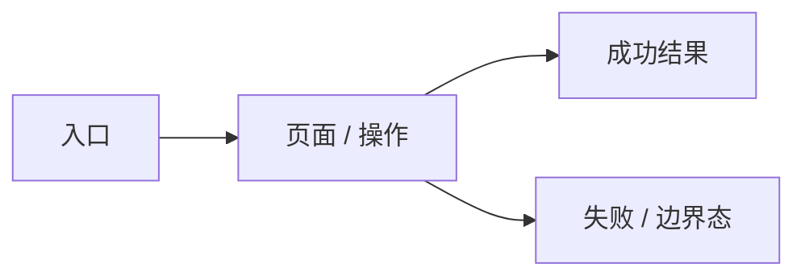

# UI Design

> 本 artifact 只处理用户可见体验、页面结构、交互状态、视觉风格和可验收原型。若本 work item 不涉及 UI，写明 N/A、理由和验证方式，不要顺手写技术架构。

## 0. 适用性判断

| 判断项 | 结论 | 依据 |
|---|---|---|
| 是否有用户可见页面 / 组件 / 流程变化 | yes / no | |
| 是否已有设计系统 / 品牌 / Figma 约束 | yes / no | |
| 是否需要向用户确认视觉风格 | yes / no | |
| 原型 / 线稿交付方式 | Pencil / Figma / HTML / ASCII / N/A | |
| 是否需要 DESIGN.md / wiki 设计系统 fallback | yes / no | |

若无 UI 影响，在这里写 N/A 结论、跳过理由和验证方式，然后删除或标记后续章节为 N/A。

## 1. 输入依据

- 来自 requirements：
- 来自 brief / 用户澄清：
- 现有页面 / 组件库 / 设计系统：
- 参考产品 / 设计稿 / 截图 / getdesign.md 风格对象：
- 不确定项：

## 2. Visual Style Brief

| 项 | 结论 |
|---|---|
| 用户确认 | |
| 参考方向 | |
| 产品气质 | |
| 信息密度 | 宽松 / 标准 / 紧凑 |
| 色彩方向 | |
| 组件形态 | |
| 排版倾向 | |
| 动效范围 | |
| 暗色模式 | N/A / 本期包含 / 后续 |
| 不采用 | |

### 参考设计语言提取

> 用户提供示例设计、截图、规范、getdesign.md 风格对象或参考产品时必填。不要只贴链接，要提取能指导实现的视觉规则。

| 来源 | 可复用设计语言 | 不适合本项目的部分 | 落地方式 |
|---|---|---|---|
| | 信息密度 / 网格 / 导航 / 色彩 / 字体 / 表格 / 表单 / 卡片 / 反馈 | | |

### 风格候选与取舍

无现成设计系统时必须给用户 5 个候选方向；已有设计系统时写“沿用现有设计系统”，并说明是否仍需要风格补充。

| 候选方向 | 适合点 | 风险 | 结论 |
|---|---|---|---|
| 企业后台 / 数据密集 | | | |
| 开发者工具 / 工程化 | | | |
| 现代 SaaS / 轻量运营 | | | |
| 内容 / 编辑器 | | | |
| 品牌化 / 对外展示 | | | |

### 外部风格参考归一化

| 外部来源 | 是否使用 | 原始输入 | 归一化到本项目的结论 |
|---|---|---|---|
| frontend-design | yes / no | | |
| getdesign | yes / no | | |
| design-md | yes / no | | |
| pencil | yes / no | | |
| Figma 官方 MCP / OpenAI curated skills | yes / no | | |

## 3. 影响范围

| 页面 / 组件 | 新增 / 修改 / 不在范围 | 路径或入口 | 使用者 | 主要状态 |
|---|---|---|---|---|
| | | | | |

## 4. 页面地图



## 5. 用户流程

### Flow 1: 

- 使用者：
- 触发：
- 正常路径：
- 异常出口：
- 成功反馈：
- 权限 / 审批影响：

## 6. UI Artifact Decision

| 产出通道 | 是否采用 | 证据路径 / 链接 | 选择理由 | 用户确认记录 |
|---|---|---|---|---|
| Pencil MCP | | | | |
| Figma MCP / 官方 Figma skills | | | | |
| HTML mockup | | | | |
| ASCII / Markdown | | | | |
| DESIGN.md / wiki design-system fallback | | | | |

## 7. Wireframe / Prototype Evidence

### Pencil

- `.pen` 文件：`01-spec/ui-mockup.pen` / N/A
- 导出截图目录：`01-spec/ui-mockup-export/` / N/A
- Pencil MCP 操作摘要：
- 自检结论：

### Figma

- 文件链接：
- Section：
- 关键 Frame：
- 截图备份目录：`01-spec/ui-mockup-export/` / N/A
- 权限验证：

### HTML

- 文件：`01-spec/ui-mockup.html` / N/A
- 可查看页面 / 状态：
- 预览验证 / 截图证据：

### ASCII

```text
N/A
```

## 8. Interaction State Matrix

| 页面 / 组件 | Default | Loading | Empty | Error | Permission / Disabled | Success | Boundary | Responsive | A11y |
|---|---|---|---|---|---|---|---|---|---|
| | | | | | | | | | |

## 9. 视觉质量 Review 与修正记录

> 有 Pencil / Figma / HTML 可视原型时必填。ASCII 低保真场景可写 N/A 和原因。

| 检查项 | 发现 | 修正动作 | 结论 |
|---|---|---|---|
| 信息层级 / 视觉焦点 | | | pass / fail |
| 间距 / 对齐 / 网格 | | | pass / fail |
| 信息密度 | | | pass / fail |
| 色彩 / token / 对比度 | | | pass / fail |
| 组件一致性 | | | pass / fail |
| 状态反馈 | | | pass / fail |
| 可访问性基础 | | | pass / fail |

截图 / Frame / 导出证据：

-

## 10. 与 requirements 的对应关系

| Requirement | UI 覆盖位置 | 原型 / 截图 / Frame | 备注 |
|---|---|---|---|
| | | | |

## 11. UI 验证策略

| 验证项 | 工具 / 方法 | 通过标准 |
|---|---|---|
| 视觉还原 | Playwright screenshot / 人工确认 | |
| 页面流程 | Playwright / 手工操作 | |
| 浏览器运行诊断 | DevTools console / network / DOM / a11y | |
| 角色权限 | 角色矩阵 | |
| 响应式 | desktop / mobile viewport | |
| 异常态 | mock error / 空数据 / 无权限 | |
| 无障碍 | keyboard / focus / aria / contrast | |
| UI guideline review | web-design-guidelines / 手工 review | |

## 12. 明确不做

-

## 13. 待确认

-
