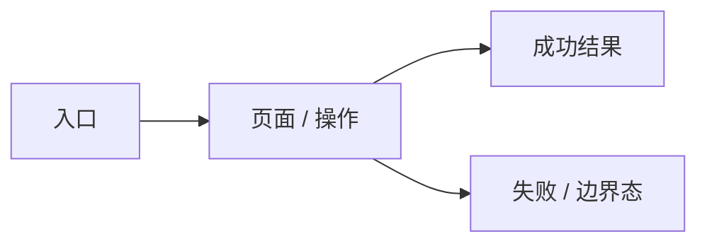

# UI Design

> 本 artifact 只处理用户可见体验、页面结构、交互状态、视觉风格和 Pencil 原型证据。若本 work item 不涉及 UI，写明 N/A、理由和验证方式，不要顺手写技术架构。

## 0.0 一页摘要

- 体验结论：
- 已确认决策：
- 最大风险：
- 下一步：
- 需要用户确认的唯一问题：

## 0. 适用性判断

| 判断项 | 结论 | 依据 |
|---|---|---|
| 是否有用户可见页面 / 组件 / 流程变化 | yes / no | |
| 是否已有设计系统 / 品牌 / 页面约束 | yes / no | |
| 是否需要向用户确认视觉方向 | yes / no | |
| UI Direction Status | confirmed / blocked | `brief.md` / `brainstorm.md` / `prd.md` / `requirements.md` 中的真实 UI 确认标记或用户确认记录 |
| 正式原型交付方式 | Pencil / N/A | |

若无 UI 影响，在这里写 N/A 结论、跳过理由和验证方式，然后将后续章节标记为 N/A。

若 `UI Direction Status` 不是 `confirmed`，停止在这里：写真实 UI decision-needed marker，回到 `sf-brainstorm` 让用户选择体验方向。不要继续填 Visual Style Brief、页面地图或 Pencil 原型。

## 1. 输入依据

- 来自 requirements：
- 来自 PRD / brief / 用户澄清：
- 现有页面 / 组件库 / 设计系统：
- 设计规范 / 模板：
- 参考产品 / 设计稿 / 截图 / Pencil / Figma：
- 不确定项：

## 2. 目标用户画像（Personas）

> 画像必须基于用户调研或已有数据，不允许凭空臆测。每个画像包含目标、痛点和行为模式。详见 `product.md#用户画像` 标准。

| 画像 | 目标 | 痛点 | 行为模式 | 使用场景 |
|---|---|---|---|---|
| | | | | |

### HMW 问题（如何能）

> 将画像的痛点转化为设计机会，驱动后续的体验方向选择。

- HMW …？
- HMW …？

## 3. UI 设计访谈与方向选择

> 本节必须引用用户确认、现有设计系统或明确低风险默认。Agent recommendation 不是用户确认。

| 分类 | 内容 |
|---|---|
| 已确认 | |
| 高影响未知 | |
| 可安全默认 | |

### 候选体验方向

| 方向 | 适合点 | 风险 | 推荐 / 用户选择 |
|---|---|---|---|
| 方向 A | | | |
| 方向 B | | | |
| 方向 C | | | |

### 用户确认记录

| 确认来源 | 用户选择 | 放弃项 | 对 UI design 的影响 |
|---|---|---|---|
| `00-intake/brainstorm.md` / 对话 / 现有设计系统 | | | |

## 4. Visual Style Brief

| 项 | 结论 |
|---|---|
| 用户确认 / 默认假设 | |
| Design Mode | Product UI / Brand Surface / Hybrid |
| UI stack / reference | 现有设计系统 / `core/skills/ui-ux/design-system` / PC 业务系统规范 / shadcn-vue / design-taste-frontend / 其他 |
| 产品气质 | |
| 信息密度 | 宽松 / 标准 / 紧凑 |
| 色彩方向 | |
| 组件形态 | |
| 排版倾向 | |
| 动效范围 | |
| 响应式策略 | |
| 不采用 | |

### 设计系统 / PC 业务系统规范

> 若采用 `.specforge/core/standards/pc-ui-design-spec.md`，本节必须填完整；否则写 N/A。

| 项 | 值 |
|---|---|
| 规范来源 | PC 端业务系统 UI 设计规范 / 现有项目设计系统 / N/A |
| 适用原因 | 后台 / 管理系统 / 数据表格系统 / 用户明确指定 / N/A |
| 画布与布局 | `1920x920px`; top nav `64px`; side nav `208px` / collapsed `68px`; module gap `16px` |
| 字体 | 中文 `"阿里巴巴普惠体 3.0", "Alibaba PuHuiTi 3.0", sans-serif`; 英文/数字 `"D-DIN EXP", "DIN", monospace` |
| 字号 / 行高 | `12/20`, `14/22`, `16/24`, `18/26`, `20/28`, `22/30`, `24/32` |
| 主色 / 状态 | primary `#277DEA`; hover `#4998FC`; active `#1D6BD0`; disabled `rgba(39,125,234,.5)` |
| 功能色 | success `#28CE89`; warning `#FFB92E`; danger `#F56C6C` |
| 中性色 | text `#333333/#666666/#999999`; bg `#F5F7FA`; disabled `#F5F5F5`; border `#E8E8E8` / `rgba(0,0,0,.10)` |
| 组件尺寸 | button/input/select `32px`; radius `8px`; table row `46px`; modal min `520px`; drawer `480/720/960px` |
| HTML/CSS 约束 | 必须使用规范 token；不得使用未定义外部默认主题；不得用 emoji 图标；不得擅自引入渐变/毛玻璃/营销页 hero |
| 偏离项 | 无 / 写明偏离原因、替代 token 和验证方式 |

### 参考设计语言提取

| 来源 | 可复用设计语言 | 不适合本项目的部分 | 落地方式 |
|---|---|---|---|
| | 信息密度 / 网格 / 导航 / 色彩 / 字体 / 表格 / 表单 / 卡片 / 反馈 | | |

### 管理端 / shadcn 组件封装契约

> 仅在后台、管理端、配置台、数据表格系统，或实现层采用 shadcn/ui 时填写；否则写 N/A。shadcn/ui 是 primitive 层，不是最终页面结构。

| 层级 | 采用的封装 | 关键规则 / 状态 |
|---|---|---|
| App Shell | Sidebar / Topbar / Breadcrumb / Command Search / N/A | 导航层级、折叠、当前定位、移动端 |
| Resource Page | PageHeader / ActionBar / Filter Bar / Saved Views / Bulk Actions / N/A | 主任务、主次操作、筛选保存、批量操作 |
| Entity Table | TanStack Table wrapper / Data Grid / N/A | 排序、筛选、分页、列显隐、密度、空/错/加载 |
| Detail / Form | DetailHeader / Form Section / Sticky Save Bar / Tabbed Detail / N/A | 校验、脏数据保护、保存反馈、只读/禁用 |
| State Feedback | EmptyState / LoadingSkeleton / ErrorState / PermissionDenied / Toast / N/A | 文案、恢复路径、重试、权限显示 |
| Ops Pattern | Import / Export / Async Job / Audit Log / Approval Timeline / N/A | 长任务、失败恢复、审计、审批 |

## 5. 信息架构（Information Architecture）

> 信息架构决定内容如何组织、标签如何命名、导航如何运行。用户找不到的功能等于不存在。

### 导航结构

| 导航模式 | 选择 | 理由 |
|---|---|---|
| 主导航 | 顶部 / 侧边 / 底部 | |
| 次要导航 | 标签页 / 面包屑 / 汉堡菜单 | |
| 移动端适配 | 底部导航 / 折叠 / 保持 | |

### 页面层级

### 标签命名验证

| 标签 | 用户理解度 | 验证方式 | 结论 |
|---|---|---|---|
| | 高 / 中 / 低 | 卡片排序 / 用户测试 / 沿用行业惯例 | pass / 需改 |

## 6. 影响范围

| 页面 / 组件 | 新增 / 修改 / 不在范围 | 路径或入口 | 使用者 | 主要状态 |
|---|---|---|---|---|
| | | | | |

## 7. 用户流程与交互设计

### Flow 1:

- 使用者：
- 画像映射：
- 触发：
- 正常路径：
- 异常出口：
- 成功反馈：
- 权限 / 审批影响：

### 多步骤流程设计

| 流程 | 总步骤 | 进度指示 | 后退保留数据 | 自动保存 | 提交前汇总 |
|---|---|---|---|---|---|
| | | yes / no | yes / no | yes / no | yes / no |

### 错误恢复策略

| 错误类型 | 检测时机 | 文案 | 保留有效输入 | 替代路径 |
|---|---|---|---|---|
| 表单校验 | 内联 / 提交时 | | yes / no | |
| 网络失败 | | | yes / no | 重试 / 离线队列 |
| 权限不足 | | | N/A | 提示联系管理员 / 隐藏按钮 |

## 8. 微文案（Microcopy）

> 微文案最直接影响用户是否完成任务。每个交互触点的文案都必须具体、可操作、无责备。

| 类型 | 文案 | 符合原则 |
|---|---|---|
| 主要 CTA 按钮 | | 动词 + 名词 |
| 空态提示 | | 告诉用户下一步 |
| 错误提示 | | 具体 + 可修复 |
| 确认对话框 | | 说明后果 |
| 加载状态 | | 解释在做什么 |
| 成功反馈 | | 确认完成 |

## 9. Pencil 原型证据

| 项 | 值 |
|---|---|
| `.pen` 文件 | `01-spec/ui-mockup.pen` / N/A |
| Pencil 保存状态 | saved / blocked / N/A |
| 保存后重读校验 | pass / fail / N/A |
| 重读证据 | 节点 id / 页面名称 / `batch_get` 摘要 / 截图路径 |
| 导出截图目录 | `01-spec/ui-mockup-export/` / N/A |
| Pencil 操作摘要 | |
| 空画布处理 | N/A / 已创建第一屏 / 阻断 |
| 自检结论 | |

### 关键截图

| 页面 / 状态 | 截图路径 | 覆盖内容 |
|---|---|---|
| | `01-spec/ui-mockup-export/...png` | |

## 10. Interaction State Matrix

| 页面 / 组件 | Default | Loading | Empty | Error | Permission / Disabled | Success | Boundary | Responsive | A11y |
|---|---|---|---|---|---|---|---|---|---|
| | | | | | | | | | |

## 11. 无障碍合规自查（WCAG 2.1 AA）

> 无障碍是设计阶段的底线，不是实现后的附加功能。以下各项必须逐一确认。

### 感知性（Perceivable）

| 检查项 | 状态 | 证据 / 备注 |
|---|---|---|
| 文本对比度 ≥ 4.5:1（常规）/ 3:1（大文本） | pass / fail | |
| 图片有描述性 alt 文本 | pass / fail / N/A | |
| 装饰性图片使用 alt="" | pass / fail / N/A | |
| 不仅用颜色传达语义（错误、状态等） | pass / fail | |

### 可操作性（Operable）

| 检查项 | 状态 | 证据 / 备注 |
|---|---|---|
| 所有交互元素可键盘抵达和操作 | pass / fail | |
| 焦点指示器清晰可见（≥ 2px 高对比度） | pass / fail | |
| 触摸目标 ≥ 44×44 CSS 像素 | pass / fail / N/A | |
| 提供 Skip to main content 跳转 | pass / fail | |

### 可理解性（Understandable）

| 检查项 | 状态 | 证据 / 备注 |
|---|---|---|
| 所有表单输入有可见关联 label | pass / fail | |
| 错误用文字描述，不仅用颜色 | pass / fail | |
| 破坏性操作有确认步骤 | pass / fail | |
| HTML lang 属性正确设置 | pass / fail | |

### 健壮性（Robust）

| 检查项 | 状态 | 证据 / 备注 |
|---|---|---|
| 使用语义 HTML 元素 | pass / fail | |
| ARIA 仅在语义 HTML 不足时使用 | pass / fail | |
| 导航顺序跨页面一致 | pass / fail | |

## 12. 视觉质量 Review 与修正记录

> 有 UI 影响时必填。先看 Pencil 导出截图，再修 Pencil，不把"实现时优化"当通过。

| 检查项 | 发现 | 修正动作 | 结论 |
|---|---|---|---|
| 信息层级 / 视觉焦点 | | | pass / fail |
| 间距 / 对齐 / 网格 | | | pass / fail |
| 信息密度 | | | pass / fail |
| 色彩 / token / 对比度 | | | pass / fail |
| 组件一致性 | | | pass / fail |
| 状态反馈 | | | pass / fail |
| 响应式基础 | | | pass / fail |
| 可访问性基础 | | | pass / fail |

## 13. UX 可用性评估计划

> 定义后续可用性测试的指标和方法，确保设计决策有数据支撑而非拍脑袋。

### 测试指标

| 指标 | 测量方式 | 目标值 |
|---|---|---|
| 任务成功率（Task Success Rate） | 用户完成核心任务的百分比 | ≥ 85% |
| 任务耗时（Time on Task） | 完成核心任务的平均时间 | 根据任务复杂度定义 |
| 错误率（Error Rate） | 用户操作过程中的错误次数 | ≤ 2 次/任务 |
| 满意度评分（Satisfaction Score） | SUS 或自定义量表 | ≥ 68/100 (SUS) |

### 测试计划

| 项 | 值 |
|---|---|
| 测试类型 | 有主持 / 无主持 / 远程 / 面对面 |
| 参与人数 | 5-8 人 |
| 核心测试任务 | |
| 测试场景 | |

## 14. 与 requirements 的对应关系

| Requirement | UI 覆盖位置 | Pencil 页面 / 截图 | 备注 |
|---|---|---|---|
| | | | |

## 15. UI 验证策略

| 验证项 | 工具 / 方法 | 通过标准 |
|---|---|---|
| 视觉还原 | Playwright screenshot / 人工确认 | |
| 页面流程 | Playwright | |
| 角色权限 | Playwright / 角色矩阵 | |
| 响应式 | desktop / mobile viewport | |
| 异常态 | mock error / 空数据 / 无权限 | |
| 无障碍 | keyboard / focus / aria / contrast | |

## 16. 明确不做

-

## 17. 待确认

-
