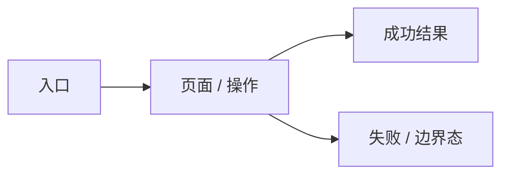

# UI Design

> 本 artifact 只处理用户可见体验、页面结构、交互状态、视觉风格和 Pencil 原型证据。若本 work item 不涉及 UI，写明 N/A、理由和验证方式，不要顺手写技术架构。

## 0. 适用性判断

| 判断项 | 结论 | 依据 |
|---|---|---|
| 是否有用户可见页面 / 组件 / 流程变化 | yes / no | |
| 是否已有设计系统 / 品牌 / 页面约束 | yes / no | |
| 是否需要向用户确认视觉方向 | yes / no | |
| 正式原型交付方式 | Pencil / N/A | |

若无 UI 影响，在这里写 N/A 结论、跳过理由和验证方式，然后将后续章节标记为 N/A。

## 1. 输入依据

- 来自 requirements：
- 来自 PRD / brief / 用户澄清：
- 现有页面 / 组件库 / 设计系统：
- 参考产品 / 设计稿 / 截图 / Pencil / Figma：
- 不确定项：

## 2. UI 设计访谈与方向选择

| 分类 | 内容 |
|---|---|
| 已确认 | |
| 高影响未知 | |
| 可安全默认 | |

### 候选体验方向

| 方向 | 适合点 | 风险 | 推荐 / 用户选择 |
|---|---|---|---|
| 方向 A | | | |
| 方向 B | | | |
| 方向 C | | | |

## 3. Visual Style Brief

| 项 | 结论 |
|---|---|
| 用户确认 / 默认假设 | |
| 产品气质 | |
| 信息密度 | 宽松 / 标准 / 紧凑 |
| 色彩方向 | |
| 组件形态 | |
| 排版倾向 | |
| 动效范围 | |
| 响应式策略 | |
| 不采用 | |

### 参考设计语言提取

| 来源 | 可复用设计语言 | 不适合本项目的部分 | 落地方式 |
|---|---|---|---|
| | 信息密度 / 网格 / 导航 / 色彩 / 字体 / 表格 / 表单 / 卡片 / 反馈 | | |

## 4. 影响范围

| 页面 / 组件 | 新增 / 修改 / 不在范围 | 路径或入口 | 使用者 | 主要状态 |
|---|---|---|---|---|
| | | | | |

## 5. 页面地图

## 6. 用户流程

### Flow 1:

- 使用者：
- 触发：
- 正常路径：
- 异常出口：
- 成功反馈：
- 权限 / 审批影响：

## 7. Pencil 原型证据

| 项 | 值 |
|---|---|
| `.pen` 文件 | `01-spec/ui-mockup.pen` / N/A |
| 导出截图目录 | `01-spec/ui-mockup-export/` / N/A |
| Pencil 操作摘要 | |
| 空画布处理 | N/A / 已创建第一屏 / 阻断 |
| 自检结论 | |

### 关键截图

| 页面 / 状态 | 截图路径 | 覆盖内容 |
|---|---|---|
| | `01-spec/ui-mockup-export/...png` | |

## 8. Interaction State Matrix

| 页面 / 组件 | Default | Loading | Empty | Error | Permission / Disabled | Success | Boundary | Responsive | A11y |
|---|---|---|---|---|---|---|---|---|---|
| | | | | | | | | | |

## 9. 视觉质量 Review 与修正记录

> 有 UI 影响时必填。先看 Pencil 导出截图，再修 Pencil，不把“实现时优化”当通过。

| 检查项 | 发现 | 修正动作 | 结论 |
|---|---|---|---|
| 信息层级 / 视觉焦点 | | | pass / fail |
| 间距 / 对齐 / 网格 | | | pass / fail |
| 信息密度 | | | pass / fail |
| 色彩 / token / 对比度 | | | pass / fail |
| 组件一致性 | | | pass / fail |
| 状态反馈 | | | pass / fail |
| 响应式基础 | | | pass / fail |
| 可访问性基础 | | | pass / fail |

## 10. 与 requirements 的对应关系

| Requirement | UI 覆盖位置 | Pencil 页面 / 截图 | 备注 |
|---|---|---|---|
| | | | |

## 11. UI 验证策略

| 验证项 | 工具 / 方法 | 通过标准 |
|---|---|---|
| 视觉还原 | Playwright screenshot / 人工确认 | |
| 页面流程 | Playwright | |
| 角色权限 | Playwright / 角色矩阵 | |
| 响应式 | desktop / mobile viewport | |
| 异常态 | mock error / 空数据 / 无权限 | |
| 无障碍 | keyboard / focus / aria / contrast | |

## 12. 明确不做

-

## 13. 待确认

-
