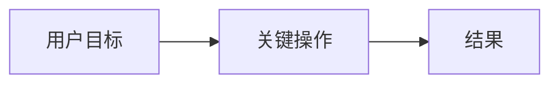
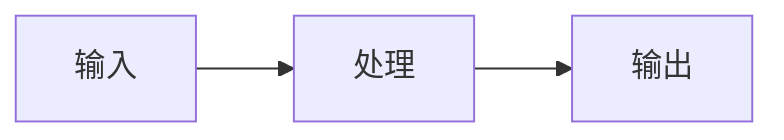

# Design

## 摘要

## 分析上下文包

- 需求理解摘要：
- 代码库约束：
- 外部资料结论：
- 用户确认的取舍：
- 仍需防守的假设：

## 技术栈决策

| 领域 | 选择 | 对齐 profile | 备选方案 | 理由 |
|---|---|---|---|---|

## 需求追踪

| Requirement | Design Decision |
|---|---|

## 边界承诺

### 允许写入范围

### 禁止范围

### 上游契约

### 下游重新验证

## 影响区域

## 页面地图

| 页面 | 路径 | 用户目标 | 入口 | 主要状态 |
|---|---|---|---|---|

## 用户流程

## 线稿 / 原型

| 页面 | 结构草图或原型链接 | 说明 |
|---|---|---|

## 视觉方向

- 主题关键词：
- 主色：
- 辅助色：
- 背景色：
- 文本色：
- 字体倾向：
- 布局密度：
- 暗色模式：

## 组件与交互状态

| 组件 / 页面 | loading | empty | error | success | disabled | destructive confirmation | mobile |
|---|---|---|---|---|---|---|---|

## 数据和 API 变化

## 文件结构计划

| Path | Ownership | Notes |
|---|---|---|

## 流程

## 验证策略

## 风险

## 备选方案
