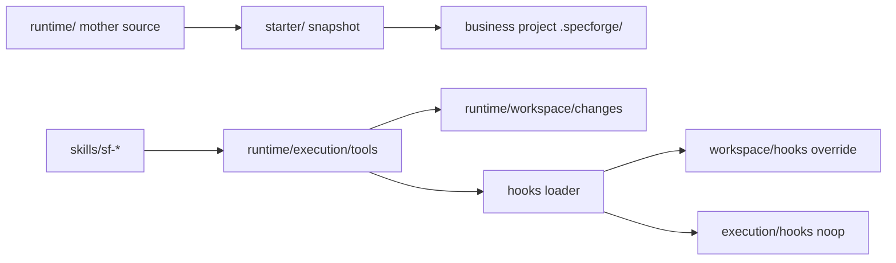

# Design

## 摘要

本变更采用“先兼容、后切主入口、最后清旧路径”的迁移设计。源码仓库将形成五个主要顶层目录：`skills/`、`runtime/`、`starter/`、`docs/`、`cli/`。业务项目输出目录仍为 `.specforge/`。迁移后 `runtime/` 是母本，`starter/` 是从母本生成的业务项目 `.specforge/` 快照，`skills/sf-*` 是安装给 Agent 的入口技能。

## 分析上下文包

- 需求理解摘要：目录结构需要消除语义冲突，尤其是 `.specforge` 母本/副本同名和 `skills` 双重含义。
- 代码库约束：现有工具、文档和 skills 大量硬编码 `.specforge`、`specforge-*`、`specforge-onboard/assets/starter/.specforge`。
- 外部资料结论：未触发外部研究；如 implementation 涉及 npm package `files` 边界，可补查 npm 官方文档。
- 用户确认的取舍：使用 `sf-*`；源码母本为 `runtime/`；阶段母本为 `stages/`；starter 扁平化；commands 是快捷入口；hooks 默认 noop 且业务可覆盖。
- 仍需防守的假设：旧 `specforge-*` 需要过渡期；根级 README 可能仍需保留 shim 以适配 GitHub/npm 展示；业务项目仍使用 `.specforge/`。

## 技术栈决策

| 领域 | 选择 | 对齐 profile | 备选方案 | 理由 |
|---|---|---|---|---|
| Runtime tools | Node ESM scripts | 现有工具模式 | shell scripts | 复用当前 `.mjs` 工具和 package `type: module` |
| Skill naming | `sf`, `sf-*` | 不适用 | 无前缀 / `specforge-*` | 用户明确希望输入 `sf` 发现技能；短且保留命名空间 |
| Compatibility | 新 `sf-*` + 旧 `specforge-*` wrapper | 不适用 | 立即删除旧入口 | 降低破坏性 |
| Starter source | `runtime/` → `starter/` | 不适用 | `starter/.specforge/` 嵌套 | 扁平化核心交付物 |
| Hook model | default noop + workspace override | 不适用 | 工具内写死集成 | 用户项目集成不应改 core tools |

## 需求追踪

| Requirement | Design Decision |
|---|---|
| 根目录职责清晰 | 目标顶层目录为 `skills/`, `runtime/`, `starter/`, `docs/`, `cli/` |
| `sf-*` 调用前缀 | 新入口技能放在 `skills/sf*`，frontmatter name 同目录 |
| 旧入口兼容 | 保留 `legacy/skills/specforge*` 或根级 wrapper，安装脚本支持过渡安装 |
| runtime 母本清晰 | 源码母本从 `.specforge/` 迁移到 `runtime/` |
| stages 避免重名 | 内部阶段母本迁移到 `runtime/execution/stages/` |
| starter 扁平化 | `starter/` 直接保存业务项目 `.specforge/` 内容 |
| hooks | `runtime/execution/hooks/` default noop，`runtime/workspace/hooks/` override |
| commands | `runtime/execution/commands/` 保存 slash command 卡片 |
| docs / cli 归位 | 维护者文档进 `docs/`，CLI 进 `cli/`，根 README 可做 shim |

## 边界承诺

### 允许写入范围

- `skills/`
- `runtime/`
- `starter/`
- `docs/`
- `cli/`
- `package.json`
- 过渡兼容目录，例如 `legacy/` 或根级 wrapper。
- 当前 active change 证据。

### 禁止范围

- `.git/`
- `.claude/`
- 历史 `.specforge/changes/archive/*` 内容。
- 用户全局技能目录，除非 closure 前执行明确的 install sync。

### 上游契约

- 当前 CLI 命令仍应提供 `skill add`、`init`、`doctor`。
- 业务项目仍以 `.specforge/` 作为项目工作区。
- Gate evidence 仍使用 active change 相对路径。

### 下游重新验证

- 任何路径移动都必须重跑 doctor、validate、starter check、skill install。
- 任何 skill name 变化都必须验证安装目录中 `sf-*` 可见。
- 任何 hook loader 变化都必须跑 pre/post hook smoke。

## 影响区域

| 区域 | 影响类型 | 说明 |
|---|---|---|
| Agent skills | 移动 / 重命名 | `specforge*` → `skills/sf*`，旧入口兼容 |
| Runtime source | 移动 / 重组 | `.specforge/*` → `runtime/{policy,artifacts,execution,workspace}` |
| Starter | 移动 / 生成逻辑变更 | `starter/` 扁平化 |
| CLI | 移动 / 路径适配 | `bin/specforge.mjs` → `cli/specforge.mjs` |
| Package | 更新 | scripts、bin、files |
| Tools | 路径抽象 | 所有 `.specforge` sourceRoot 相关代码 |
| Docs | 移动 / 重写 | 根级文档迁入 `docs/`，必要 shim 留根 |
| Validation | 更新 required paths | 覆盖新结构和兼容期 |

## 目标目录线稿

```text
specforge/
├─ skills/
│  ├─ sf/
│  ├─ sf-onboard/
│  ├─ sf-intake/
│  ├─ sf-spec/
│  ├─ sf-implement/
│  ├─ sf-review/
│  ├─ sf-verify/
│  ├─ sf-close/
│  ├─ sf-doctor/
│  └─ sf-work/
│
├─ runtime/
│  ├─ AGENTS.md
│  ├─ attention.md
│  ├─ manifest.yaml
│  ├─ registry.yaml
│  │
│  ├─ policy/
│  │  ├─ rules/
│  │  └─ tech-profiles/
│  │
│  ├─ artifacts/
│  │  ├─ schemas/
│  │  └─ templates/
│  │
│  ├─ execution/
│  │  ├─ stages/
│  │  ├─ tools/
│  │  ├─ commands/
│  │  └─ hooks/
│  │
│  └─ workspace/
│     ├─ knowledge/
│     ├─ changes/
│     └─ hooks/
│
├─ starter/
├─ docs/
└─ cli/
```

## Runtime 分层

| Layer | Path | Owns | Copied to starter |
|---|---|---|---|
| Meta | `runtime/AGENTS.md`, `manifest.yaml`, `attention.md` | 项目入口和路径策略 | yes |
| Policy | `runtime/policy/*` | 稳定规则、技术栈 profile | yes |
| Artifacts | `runtime/artifacts/*` | artifact graph 和模板 | yes |
| Execution | `runtime/execution/*` | stages、tools、commands、default hooks | yes |
| Workspace | `runtime/workspace/*` | 本仓库自举知识、changes、project hooks | partial: starter gets empty workspace |

## Hooks 设计

### Hook 文件布局

```text
runtime/execution/hooks/
├─ pre-gate.mjs
├─ post-gate.mjs
├─ pre-archive.mjs
├─ post-archive.mjs
└─ on-close.mjs

runtime/workspace/hooks/
└─ project overrides
```

### Hook 加载顺序

```text
workspace/hooks/<event>.mjs
  else execution/hooks/<event>.mjs
  else built-in noop
```

### Hook 接口

```js
export default async function hook(context) {
  return { ok: true, message: "noop" };
}
```

`context` 至少包含：

```js
{
  event,
  cwd,
  changeId,
  changeBase,
  gate,
  status,
  evidence,
  timestamp
}
```

### 失败策略

- pre hook: failure blocks the core action.
- post hook: failure reports warning by default; `manifest.yaml` can opt into strict mode later.

## 数据和 API 变化

不涉及外部 API。内部路径常量建议集中到 `runtime/execution/tools/lib/paths.mjs` 或并入现有 `specforge.mjs`，至少包含：

```js
runtimeRoot
policyRoot
artifactsRoot
executionRoot
workspaceRoot
starterRoot
skillsRoot
```

## 文件结构计划

| Path | Ownership | Notes |
|---|---|---|
| `skills/sf*/SKILL.md` | Agent entry skills | 新入口 |
| `legacy/skills/specforge*/SKILL.md` 或 root wrapper | Compatibility | 迁移期保留 |
| `runtime/policy/rules/` | Rules | 原 `.specforge/rules` |
| `runtime/policy/tech-profiles/` | Tech profiles | 原 `.specforge/tech-profiles` |
| `runtime/artifacts/schemas/` | Artifact graph | 原 `.specforge/schemas` |
| `runtime/artifacts/templates/` | Templates | 原 `.specforge/templates` |
| `runtime/execution/stages/` | Stage mother skills | 原 `.specforge/skills` |
| `runtime/execution/tools/` | Runtime tools | 原 `.specforge/tools` |
| `runtime/execution/commands/` | Command cards | 原 `.specforge/commands` |
| `runtime/execution/hooks/` | Default hooks | new |
| `runtime/workspace/knowledge/` | SSoT | 原 `.specforge/knowledge` |
| `runtime/workspace/changes/` | Changes | 原 `.specforge/changes` |
| `runtime/workspace/hooks/` | Project hook overrides | new |
| `starter/` | Generated snapshot | 原 `specforge-onboard/assets/starter/.specforge` |
| `docs/` | Maintainer docs | README / AGENTS / CLAUDE / adapters |
| `cli/specforge.mjs` | CLI | 原 `bin/specforge.mjs` |

## 流程



## 迁移顺序

1. Introduce path abstraction in tools while old layout still exists.
2. Add new `skills/sf*` directories and keep old entry wrappers.
3. Move `.specforge/skills` to `runtime/execution/stages`; update validation.
4. Move rules/profiles/templates/schemas/tools/commands into runtime layers; update path abstraction.
5. Move knowledge/changes into `runtime/workspace`; ensure tools still resolve active change.
6. Create flat `starter/`; update sync-starter and onboard.
7. Move CLI to `cli/`; update package scripts/bin/files.
8. Move docs/adapters to `docs/`; leave root README/AGENTS shim if needed.
9. Add hook defaults and loader smoke tests.
10. Run full validation and install skills.

## 验证策略

| 层级 | 验证内容 | 命令 / 方法 |
|---|---|---|
| Structure | required paths and templates | migrated `validate-structure` |
| Skills | `sf-*` and stage mapping | migrated `validate-skills` |
| Starter | runtime to starter drift | migrated `sync-starter-assets --check` |
| CLI | init / doctor / skill add | temp dir smoke |
| Hooks | default + override behavior | local hook smoke |
| Compatibility | old entrypoints | inspect / invoke wrappers |
| Package | bin/files/scripts | package metadata review |

## 风险

| 风险 | 等级 | 缓解 |
|---|---|---|
| Path hardcoding breaks runtime tools | 高 | 先引入 path abstraction，再移动目录 |
| Old installed skills keep calling removed names | 高 | 保留 compatibility wrappers and install sync |
| Starter copies runtime workspace state | 高 | sync tool must materialize empty workspace state |
| CLI bin path breaks npm usage | 中 | update package `bin`, scripts and docs together |
| Root README/AGENTS moved breaks repository UX | 中 | leave root shim or package files include docs |
| Hooks can make core tools flaky | 中 | default noop, strict policy opt-in |

## 备选方案

| 方案 | 选择 | 理由 |
|---|---|---|
| Big-bang move everything | 不选 | 太容易断 CLI/starter/skills |
| Keep `.specforge/` as source | 不选 | 用户已明确指出母本/副本歧义最大 |
| Install only `sf-*` and delete old skills | 不选 | 破坏现有用户 |
| Put commands in docs | 不选 | commands 是 Agent UI 快捷入口，属于 execution |
| Single hooks dir only | 不选 | 用户自定义 hook 可能被 runtime 升级覆盖 |
